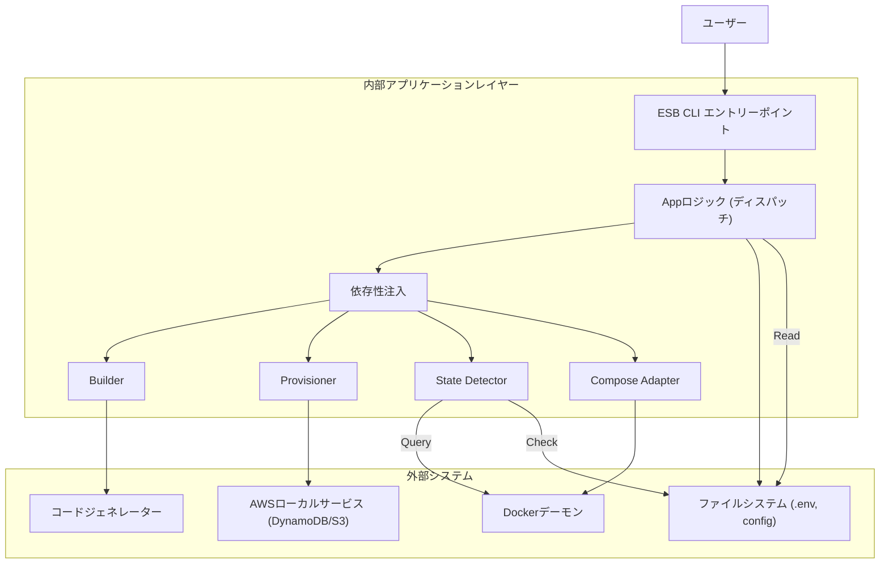
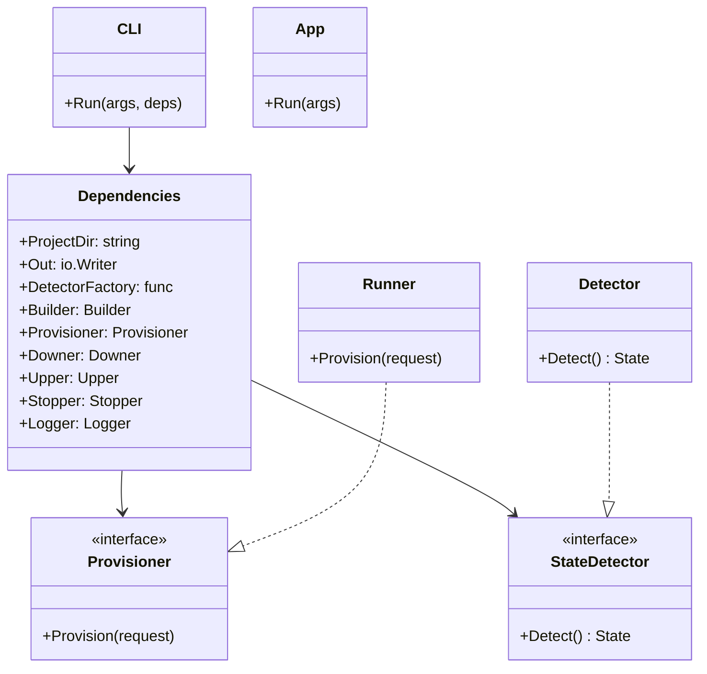
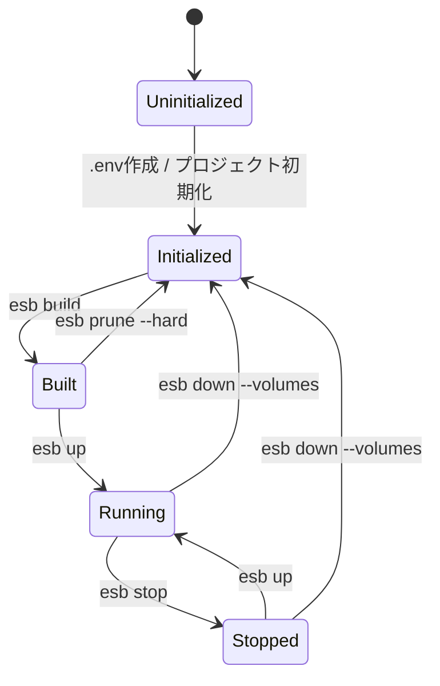

# ESB CLI アーキテクチャ

## 概要

Edge Serverless Box (ESB) CLIは、DockerとAWS SDKを使用してローカルのサーバーレス環境を管理するために設計されたGoベースのコマンドラインツールです。テスト容易性、モジュール性、および関心事の明確な分離を確保するために、階層化されたアーキテクチャを採用しています。

## システムアーキテクチャ

以下の図は、高レベルのコンポーネントとその相互作用を示しています。

## 内部クラス構造

CLIの中核は、必要なすべてのサービスを集約する `Dependencies` 構造体を中心に構築されています。これにより、テスト時のモック化が容易になります。

## ステートマシン

CLIは、定義された状態セットを通じてローカル環境のライフサイクルを管理します。`StateDetector` は、ファイルシステムの成果物とDockerコンテナの状態に基づいて現在の状態を決定します。

### 状態定義

- **Uninitialized (未初期化)**: 有効なプロジェクトコンテキストが存在しない状態（例: `.env` やプロジェクトディレクトリの欠如）。
- **Initialized (初期化済み)**: コンテキストは有効だが、ビルド成果物やコンテナが存在しない状態。
- **Built (ビルド済み)**: ビルド成果物（Dockerfile、生成されたコード）は存在するが、コンテナは作成されていない状態。
- **Stopped (停止中)**: コンテナは存在するが、稼働していない状態。
- **Running (稼働中)**: 1つ以上のコンテナが「running」状態にある。

### 状態遷移図

## 主要コンポーネント

### 1. State Detector (`cli/internal/state`)
以下の要素を組み合わせて状態検出をオーケストレーションします。
- **コンテキスト解決**: プロジェクトの有効性をチェックします。
- **コンテナチェック**: Dockerに対して稼働中/停止中のコンテナを問い合わせます。
- **成果物検証**: `output/` ディレクトリ内の生成ファイルを確認します。

### 2. Provisioner (`cli/internal/provisioner`)
ローカルAWSリソースのセットアップを処理します。
- SAMテンプレート (`template.yaml`) の解析。
- ローカルDynamoDBテーブルおよびS3バケットの設定。
- `aws-sdk-go-v2` を使用したローカルコンテナとの通信。

### 3. Application Logic (`cli/internal/app`)
各コマンド (`up`, `down`, `build` など) のビジネスロジックを含みます。CLIインターフェース (Kong) と内部アダプターの間の接着剤として機能します。
