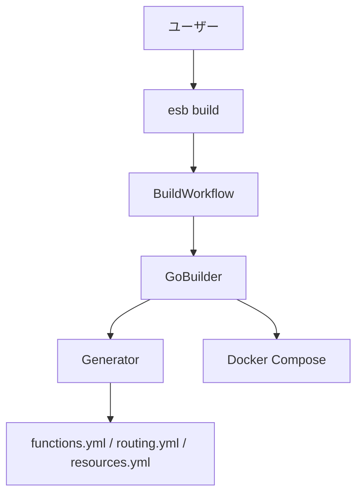

# ESB CLI アーキテクチャ（build-only）

## 概要

ESB CLI は **`esb build` に特化**した構成です。SAM テンプレートを解析し、Dockerfile / `functions.yml` / `routing.yml` / `resources.yml` を生成した上で、関数イメージとコントロールプレーンのビルドを実行します。

## 高レベル構成

## 主要コンポーネント

### CLI Adapter (`cli/internal/commands`)
- `esb build` の入力解決（template/env/mode/output/parameters）
- 対話入力（SAM Parameters）

### BuildWorkflow (`cli/internal/workflows`)
- 入力 DTO を `generator.BuildRequest` に変換し、Builder を呼び出す

### GoBuilder (`cli/internal/generator`)
- SAM テンプレートのパース
- 生成物の出力
- レジストリの起動確認（必要時）
- ベースイメージ / 関数イメージ / コントロールプレーンのビルド

## 実装ポイント

- `generator.yml` は参照しません
- SAM `Parameters` は **ビルド時に対話入力**し、そのビルドのみ有効
- 出力先は `--output` 指定時は `<output>/<env>`、未指定時は `<template_dir>/.esb/<env>`
