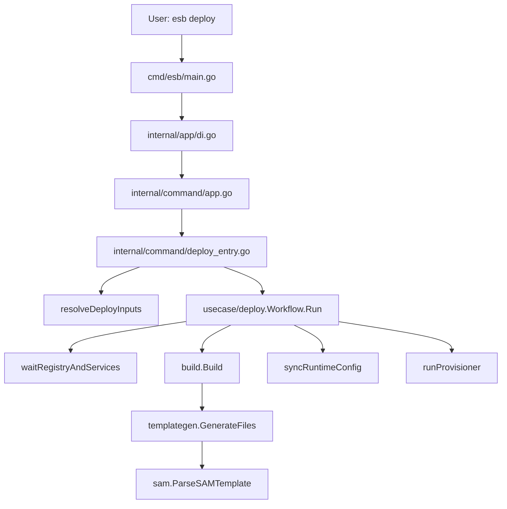

<!--
Where: docs/architecture.md
What: Source-of-truth architecture guide for CLI workflows and extension points.
Why: Keep implementation, dependency rules, and extension flow aligned.
-->
# CLI アーキテクチャ（実装準拠）

## 1. 目的とスコープ
このドキュメントは本リポジトリの実装を前提に、次を定義します。

- `esb deploy` / `esb artifact generate` / `esb artifact apply` / `esb version` の実行構造
- レイヤ責務と依存方向
- 機能拡張時の実装手順
- 変更時に通すべき品質ゲート

公開 CLI 契約（コマンド・フラグ・基本挙動）は維持し、内部構造改善はこの契約を壊さない前提で行います。

## 2. レイヤ構成
| レイヤ | パッケージ | 責務 |
| --- | --- | --- |
| Entry | `cmd/esb` | プロセス起動、DI 初期化、終了コード返却 |
| Wiring | `internal/app` | 依存注入（infra 実装の組み立て） |
| Command | `internal/command` | フラグ解釈、入力解決、対話、実行リクエスト構築 |
| Usecase | `internal/usecase/deploy` | deploy フェーズ順序制御、失敗契約 |
| Domain | `internal/domain/*` | 純粋ロジック（型、差分、正規化、テンプレート） |
| Infra | `internal/infra/*` | Docker/Compose/FS/SAM 解析/UI など I/O |
| Guard | `internal/architecture` | レイヤ違反・循環依存・依存契約の自動検出 |

## 3. コマンド実行フロー

### 3.1 `esb deploy`



`Workflow.Run` の主な順序:

1. `alignGatewayRuntime`（実行中 gateway から project/network を補正）
2. `ApplyRuntimeEnv`（env defaults 適用）
3. `waitRegistryAndServices`（registry + compose service 状態確認）
4. `prepareBuildPhase`
5. `runBuildPhase`（templategen + buildx bake）
6. `emitPostBuildSummary`
7. `runRuntimeProvisionPhase`（`build-only` 以外）

### 3.2 `esb artifact generate`

`artifact generate` は `deploy` の build フローを再利用し、`build-only` 強制で実行します。
（provision/apply は行わず、artifact manifest を生成）

### 3.3 `esb artifact apply`

`internal/command/artifact.go` から `deployops.Execute` を呼び出して、
artifact manifest を指定出力ディレクトリへ適用します。
TTY + prompter 有効時は、`--artifact` / `--out` 不足を対話補完します。

## 4. 入力解決の契約（`internal/command/deploy_inputs_resolve.go`）
`resolveDeployInputs` は Confirm で `Edit` が選ばれた場合に再解決ループします。

主要な決定順序:

1. `repo root` 解決
2. `project` 決定（flag -> env -> host env -> running stack -> default）
3. `env` 決定（flag/stack/runtime 推論 + mismatch reconcile）
4. `mode` 決定（推論 mode と `--mode` が衝突した場合は TTY で選択）
5. `template` 決定（flag or interactive + history/candidates）
6. `output` / `compose files` / `parameters` / `image-runtime` を解決
7. 最終確認 prompt（TTY 時、Proceed/Edit）

現在の interactive 仕様:

- stack 複数時の選択肢ラベルは `stack (project=..., env=...)`
- stack 無効選択は warning を出して再入力
- image runtime prompt は `function + image URI + default runtime` を表示
- `project` / `output` / `compose files` 未指定時は TTY で補完

詳細は `docs/deploy-interactive-inputs.md` を参照。

## 5. Build / Generate / Parse の責務境界

- `internal/infra/build`
  - フェーズ実行のオーケストレーション
  - base image / function image build
  - artifact 生成（runtime-config merge は行わない）
- `internal/infra/templategen`
  - 関数 staging、Dockerfile 生成、`functions.yml`/`routing.yml`/`resources.yml` 生成
  - bundle manifest 出力
- `internal/infra/sam`
  - SAM デコードと intrinsic 解決
  - Function/Resource の内部 spec 化

`deploy` 実行時は関数系アーティファクトを生成し、control-plane イメージは `docker compose` 側で扱います。

## 6. DI と依存方向のルール
実装ルールは `internal/architecture` のテストで強制します。

- レイヤ違反: `internal/architecture/layering_test.go`
- 循環依存: `internal/architecture/layering_cycles_test.go`
- 依存契約: `internal/architecture/dependency_contracts_test.go`

重要契約:

- `command` / `usecase` で infra の具体生成をしない（`internal/app/di.go` で注入）
- `usecase/deploy` は `docker/client` へ直接依存しない
- `internal/infra/sam` / `internal/infra/templategen` は `fmt.Print*` 直書きをしない

## 7. エラー契約と決定性

- runtime-config 同期失敗は deploy 失敗（warning にしない）
- image 関数は常に Dockerfile 経由で再ビルドし、hooks 注入済みイメージを使う
- stack/gateway 候補選択は安定順序（sort + 優先度）
- stack 検出/モード推論失敗は warning を出し、可能な限り継続

## 8. 機能拡張プレイブック

### 8.1 Deploy フラグを追加する
1. `internal/command/app.go` の `DeployCmd` に追加
2. `internal/command/deploy_entry.go` で `deploy.Request` へ橋渡し
3. 必要なら `internal/usecase/deploy/deploy.go` の `Request` に追加
4. テスト追加:
   - `internal/command/deploy_entry_test.go`
   - `internal/command/*_test.go`

### 8.2 入力解決ルールを追加する
1. `internal/command/deploy_inputs_resolve.go` に統合
2. 推論・正規化は既存分割 (`deploy_inputs_env_mode.go` / `deploy_stack.go`) に寄せる
3. テスト追加:
   - `internal/command/deploy_inputs_resolve_test.go`
   - `internal/command/deploy_running_projects_test.go`

### 8.3 Deploy フェーズを追加する
1. `internal/usecase/deploy/deploy_run.go` の順序に追加
2. フェーズ本体は新規 `deploy_*.go` へ分離
3. infra 呼び出しは interface 経由で注入
4. テスト追加:
   - `internal/usecase/deploy/deploy_test.go`

### 8.4 SAM 対応を追加する
1. `internal/infra/sam/template_functions_*.go` / `template_resources.go` を更新
2. 必要なら `internal/domain/template/types.go` を拡張
3. 生成物反映は `internal/infra/templategen/generate.go` 側で受ける
4. テスト追加:
   - `internal/infra/sam/template_parser_test.go`
   - `internal/infra/sam/template_functions_test.go`
   - `internal/infra/templategen/generate_test.go`

## 9. 変更時の推奨ゲート

最小ゲート:

```bash
go test ./internal/architecture ./internal/command ./internal/usecase/deploy ./internal/infra/runtime ./internal/infra/build ./internal/infra/deploy -count=1
go vet ./...
```

マイルストーンゲート:

```bash
mise run test
mise run lint
```

## 10. 関連ドキュメント

- `docs/build.md`
- `docs/generator-architecture.md`
- `docs/sam-parsing-architecture.md`
- `docs/container-management.md`
- `docs/deploy-interactive-inputs.md`
- `docs/command-reference.md`
