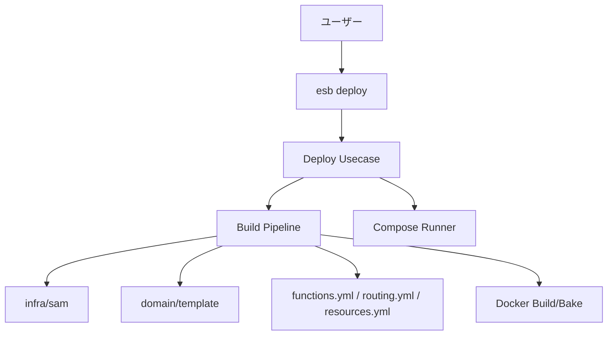

# ESB CLI アーキテクチャ（deploy-first）

> NOTE: A simplified target architecture and migration plan are documented in
> `cli/docs/architecture-redesign.md`.

## 概要
ESB CLI は **deploy を中心**に構成されています。SAM テンプレートを解析し、
`functions.yml` / `routing.yml` / `resources.yml` と Docker アーティファクトを生成した上で、
関数イメージとコントロールプレーンのビルド・プロビジョニングを行います。

## 高レベル構成

## 主要コンポーネント

### CLI Adapter (`cli/internal/command`)
- `deploy` の入力解決（template/env/mode/output/parameters）
- 対話入力（SAM Parameters）

### Deploy Usecase (`cli/internal/usecase/deploy`)
- `build.BuildRequest` の組み立て
- ランタイム環境適用
- ビルド実行 + 設定差分の出力
- Provisioner 実行

### Build Pipeline (`cli/internal/infra/build`)
- `GenerateFiles`: SAM テンプレートの読み込み、テンプレート出力
- `GoBuilder`: Docker ビルド / Bake 実行
- 出力先: `<output>/config` or `<template_dir>/.<brand>/<env>`

### Template Domain (`cli/internal/domain/template`)
- `FunctionSpec` / `ParseResult` / `EventSpec`
- `RenderFunctionsYml` / `RenderRoutingYml`
- `ApplyImageNames`

### SAM Boundary (`cli/internal/infra/sam`)
- `DecodeYAML` / `ResolveAll` wrappers
- Intrinsic resolver (`intrinsics_resolver.go`)
- AWS SAM schema decode (DynamoDB/S3 etc)

## 実装ポイント
- `generator.yml` は参照しません。
- SAM `Parameters` は **deploy 時に対話入力**し、その deploy のみ有効。
- ビルドアセットは `cli/internal/infra/build/assets` 配下に配置。
