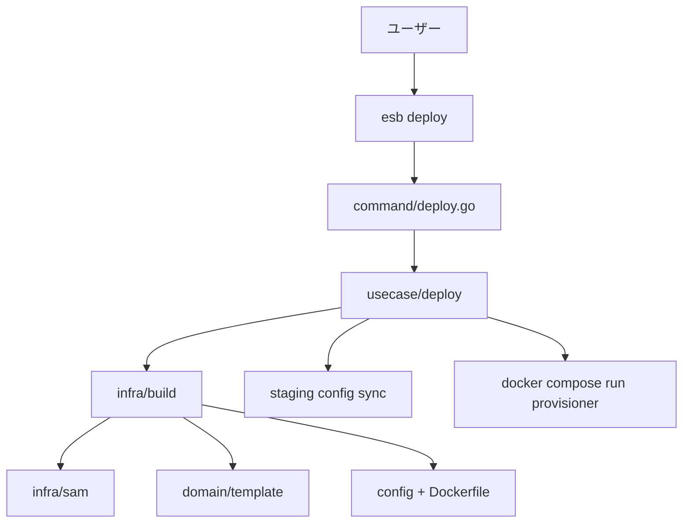

# CLI アーキテクチャ（deploy-first）

## 概要
CLI は **`deploy` を主コマンド**として設計されています。`deploy` は SAM テンプレートを解析し、
`functions.yml` / `routing.yml` / `resources.yml` を生成、関数イメージをビルドし、プロビジョナーを実行します。

補助コマンドは以下のとおりです:
- `version`（ビルド情報からのバージョン表示）

## 全体フロー

## モジュール構成

| レイヤ | パッケージ | 役割 |
| --- | --- | --- |
| Entry | `cli/cmd/esb` | Kong で CLI を起動・パース |
| Wiring | `cli/internal/app` | 依存の組み立て（DI のみ） |
| Command | `cli/internal/command` | 入力解決、対話、エラー整形 |
| Usecase | `cli/internal/usecase/deploy` | deploy ワークフローの順序制御 |
| Domain | `cli/internal/domain/*` | 依存なしの純粋ロジック（diff/出力/型） |
| Infra | `cli/internal/infra/*` | Docker/Compose/FS/Env/UI など外部 I/O |

## 主要パッケージの責務

- `internal/command`
  - `deploy` の入力解決（テンプレート、env、mode、output、parameters）
  - 実行前の確認（サマリ表示）
  - `.env` のロード（`--env-file` or カレントの `.env`）
- `internal/usecase/deploy`
  - deploy のオーケストレーション
  - ランタイム設定の同期（staging → runtime-config）
  - Provisioner 実行（docker compose run）
- `internal/infra/build`
  - SAM 解析・ステージング・Dockerfile/設定生成
  - 関数イメージの buildx bake 実行
- `internal/infra/sam`
  - `aws-sam-parser-go` 境界
  - Intrinsic 解決とリソース抽出
- `internal/domain/template`
  - `FunctionSpec` / `ParseResult` / Render
  - Image 名の正規化

## 設定ファイルと保存先

- **グローバル設定**: `<repo_root>/.<brand>/config.yaml`
  - 最近のテンプレート履歴 (`recent_templates`)
  - テンプレートごとのデフォルト入力 (`build_defaults`)
- **ステージング設定**: `<repo_root>/.<brand>/staging/<compose_project>/<env>/config`
  - `functions.yml` / `routing.yml` / `resources.yml`
  - deploy 後に runtime-config へ同期
  - 旧 `<template_dir>/.<brand>/staging` は参照しない（アップデート後は再 deploy が必要）
- **ビルド出力**: `<template_dir>/.<brand>/<env>/...`（`--output` 指定で変更）

> 補足: repo root は **CWD 基準**で決定されます。CWD から上方向に
> `docker-compose.docker.yml` / `docker-compose.containerd.yml` を探索し、
> 見つかったディレクトリが `<repo_root>` になります。

> 補足: CLI 名やブランドは `CLI_CMD` / `ENV_PREFIX` などの環境変数と `meta` により決定されます。
