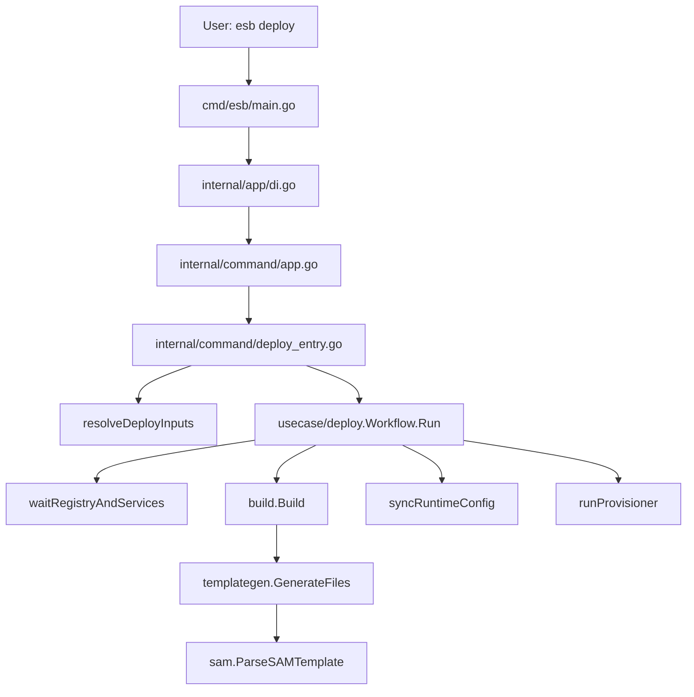

<!--
Where: cli/docs/architecture.md
What: Source-of-truth architecture guide for CLI deploy workflow and extension points.
Why: Keep implementation, dependency rules, and developer extension workflow aligned.
-->
# CLI アーキテクチャ（実装準拠）

## 1. 目的とスコープ
このドキュメントは `cli` 配下の実装を前提に、以下を定義します。

- `esb deploy` / `esb version` の実行構造
- レイヤ責務と依存方向
- 機能拡張時の実装手順（迷わないためのプレイブック）
- 変更時に通すべき品質ゲート

公開 CLI 契約（コマンド・フラグ・基本挙動）は維持し、内部構造改善はこの契約を壊さない前提で行います。

## 2. レイヤ構成
| レイヤ | パッケージ | 責務 |
| --- | --- | --- |
| Entry | `cli/cmd/esb` | プロセス起動、DI 初期化、終了コード返却 |
| Wiring | `cli/internal/app` | 依存注入（具体 infra 実装の組み立て） |
| Command | `cli/internal/command` | フラグ解釈、入力解決、対話、実行リクエスト構築 |
| Usecase | `cli/internal/usecase/deploy` | deploy フェーズ順序制御、失敗契約 |
| Domain | `cli/internal/domain/*` | 純粋ロジック（型、差分、値正規化、テンプレート） |
| Infra | `cli/internal/infra/*` | Docker/Compose/FS/SAM 解析/UI 等 I/O |
| Guard | `cli/internal/architecture` | レイヤ違反・循環依存・依存契約の自動検出 |

## 3. Deploy 実行フロー



実行順（`Workflow.Run`）:

1. `alignGatewayRuntime`（実行中 gateway から project/network を補正）
2. `ApplyRuntimeEnv`（env defaults を適用）
3. `waitRegistryAndServices`（registry + compose service 状態確認）
4. `prepareBuildPhase`（差分サマリ用スナップショット）
5. `runBuildPhase`（templategen + buildx bake）
6. `emitPostBuildSummary`
7. `runRuntimeProvisionPhase`（`build-only` 以外）

## 4. 入力解決の契約（`deploy_inputs_resolve.go`）
主要な決定順序:

1. `repo root` 解決
2. `project` 決定（flag -> env -> host env -> running stack -> default）
3. `env` 決定（flag/stack/runtime から reconcile）
4. `mode` 決定（running services -> services -> compose files -> flag/prompt）
5. `template` 決定（flag or interactive with history/candidates）
6. `output/params/compose` 統合
7. 最終確認 prompt（TTY 時）

注意点:

- 複数テンプレート時、先行テンプレートは自動で `build-only`
- `stack 未検出` と `stack 検出失敗` は区別し、検出失敗は warning を出す
- `--no-save-defaults` で defaults 永続化を抑止

## 5. Build / Generate / Parse の責務境界

- `infra/build`:
  - フェーズ実行のオーケストレーション
  - base image / function image build
  - artifact 生成（runtime-config merge は行わない）
- `infra/templategen`:
  - 関数 staging、Dockerfile 生成、`functions.yml`/`routing.yml`/`resources.yml` 生成
  - `image-import.json` と bundle manifest 出力
- `infra/sam`:
  - SAM デコードと intrinsic 解決
  - Function/Resource の内部 spec 化

`deploy` 実行時は関数系アーティファクトを生成し、control-plane イメージは `docker compose` 側で扱います。

## 6. DI と依存方向のルール
実装ルールはテストで強制します。

- レイヤ違反: `cli/internal/architecture/layering_test.go`
- 循環依存: `cli/internal/architecture/layering_cycles_test.go`
- 依存契約: `cli/internal/architecture/dependency_contracts_test.go`

重要契約:

- `command` / `usecase` で infra の具体生成をしない（`app/di.go` で注入）
- `usecase/deploy` は `docker/client` へ直接依存しない
- `infra/sam` / `infra/templategen` は `fmt.Print*` 直書きをしない（出力経路統一）

## 7. エラー契約と決定性

- `runtime-config` 同期失敗は deploy 失敗（warning にしない）
- image 関数がある場合、`--image-prewarm=off` はエラー
- gateway/runtime の候補選択は安定順序（sort + 優先度）
- stack 検出/モード推論失敗は warning を出し、可能な限り継続

## 8. 機能拡張プレイブック

### 8.1 Deploy フラグを追加する
1. `cli/internal/command/app.go` の `DeployCmd` に追加
2. `cli/internal/command/deploy_entry.go` で `deploy.Request` へ橋渡し
3. 必要なら `cli/internal/usecase/deploy/deploy.go` の `Request` に追加
4. テスト追加:
   - `cli/internal/command/deploy_entry_test.go`
   - `cli/internal/command/*_test.go`（入力解決や競合）

### 8.2 入力解決ルールを追加する
1. `cli/internal/command/deploy_inputs_resolve.go` に統合
2. 推論・正規化は既存分割 (`deploy_inputs_env_mode.go` / `deploy_stack.go`) に寄せる
3. テスト追加:
   - `cli/internal/command/deploy_inputs_resolve_test.go`
   - `cli/internal/command/deploy_running_projects_test.go`

### 8.3 Deploy フェーズを追加する
1. `cli/internal/usecase/deploy/deploy_run.go` の順序に追加
2. フェーズ本体は新規 `deploy_*.go` へ分離
3. infra 呼び出しは interface 経由で注入
4. テスト追加:
   - `cli/internal/usecase/deploy/deploy_test.go`
   - 対象フェーズ専用 `*_test.go`

### 8.4 SAM 対応を追加する（新しい関数属性・リソース）
1. `cli/internal/infra/sam/template_functions_*.go` / `template_resources.go` を更新
2. 必要なら `cli/internal/domain/template/types.go` を拡張
3. 生成物反映は `cli/internal/infra/templategen/generate.go` 側で受ける
4. テスト追加:
   - `cli/internal/infra/sam/template_parser_test.go`
   - `cli/internal/infra/sam/template_functions_test.go`
   - `cli/internal/infra/templategen/generate_test.go`

### 8.5 出力メッセージ/警告を追加する
1. `command` 層は `Out` / `ErrOut` / `ui.UserInterface` 経由に統一
2. `infra/sam` / `infra/templategen` では `fmt.Print*` を使わない
3. テストで出力捕捉可能な形を維持する

## 9. 変更時の推奨ゲート

最小ゲート（`cli` 変更時）:

```bash
cd cli && go test ./internal/architecture ./internal/command ./internal/usecase/deploy ./internal/infra/runtime ./internal/infra/build ./internal/infra/deploy -count=1
cd cli && go vet ./...
```

マイルストーンゲート:

```bash
cd cli && go test ./...
cd /home/akira/esb && X_API_KEY=dummy AUTH_USER=dummy AUTH_PASS=dummy uv run pytest -q e2e/runner/tests
cd /home/akira/esb && uv run python e2e/run_tests.py --profile e2e-docker --test-target e2e/scenarios/smoke/test_smoke.py --verbose
cd /home/akira/esb && uv run python e2e/run_tests.py --profile e2e-containerd --test-target e2e/scenarios/smoke/test_smoke.py --verbose
```

## 10. 関連ドキュメント

- ビルド詳細: `cli/docs/build.md`
- Generator 詳細: `cli/docs/generator-architecture.md`
- SAM 解析詳細: `cli/docs/sam-parsing-architecture.md`
- コンテナ運用: `cli/docs/container-management.md`
- ランタイム運用: `docs/container-runtime-operations.md`
- Docker 構成: `docs/docker-image-architecture.md`
- ローカルログ: `docs/local-logging-adapter.md`
- トレース伝播: `docs/trace-propagation.md`
