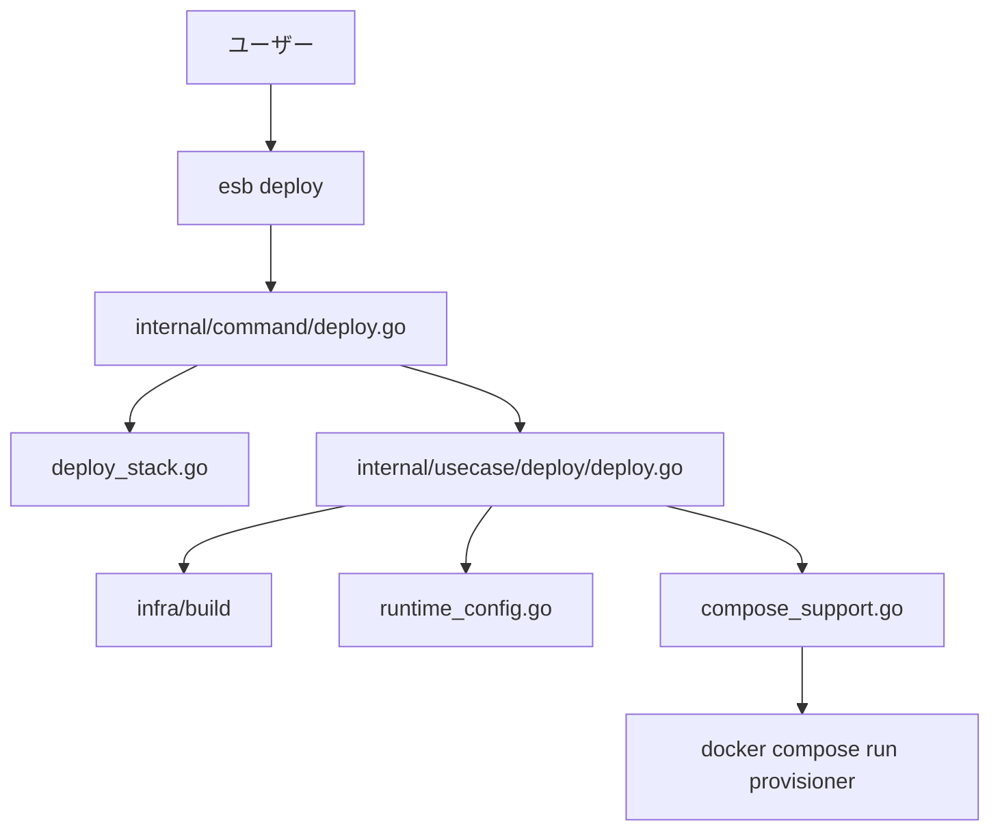

<!--
Where: cli/docs/architecture.md
What: Deploy-first CLI architecture and behavior contracts.
Why: Reflect WS2 split responsibilities and runtime sync semantics.
-->
# CLI アーキテクチャ（deploy-first）

## 概要
CLI は **`deploy` を主コマンド**として設計されています。
`deploy` は SAM テンプレート解析から config 生成、イメージ build、runtime-config 同期、
provisioner 実行までを 1 ワークフローで扱います。

補助コマンド:
- `version`（ビルド情報の表示）

## 全体フロー

## レイヤ構成
| レイヤ | パッケージ | 役割 |
| --- | --- | --- |
| Entry | `cli/cmd/esb` | Kong ベースの CLI 起動とコマンド配線 |
| Wiring | `cli/internal/app` | 依存注入（DI） |
| Command | `cli/internal/command` | 入力解決、対話、事前検証、エラー整形 |
| Usecase | `cli/internal/usecase/deploy` | deploy 手順の順序制御 |
| Domain | `cli/internal/domain/*` | テンプレート/差分/ランタイム推論の純粋ロジック |
| Infra | `cli/internal/infra/*` | Docker/Compose/FS/Env/UI/SAM など I/O |

## WS2 で分割した責務
| ファイル | 責務 |
| --- | --- |
| `cli/internal/command/deploy.go` | deploy 入力解決・interactive 選択・Request 構築 |
| `cli/internal/command/deploy_stack.go` | 実行中 stack 検出、`mode` 推論、優先順位付き stack 選択 |
| `cli/internal/usecase/deploy/deploy.go` | deploy 主オーケストレーション |
| `cli/internal/usecase/deploy/gateway_runtime.go` | gateway 実行環境の整合（project/network 補正） |
| `cli/internal/usecase/deploy/runtime_config.go` | staging config の runtime target 同期 |
| `cli/internal/usecase/deploy/compose_support.go` | compose file 解決、サービス存在検証、provisioner 実行 |
| `cli/internal/infra/build/bake.go` | buildx bake 実行、lock、エラー整形 |
| `cli/internal/infra/build/bake_proxy.go` | buildx builder の proxy 設定解決 |

## 入力解決（`deploy`）
`deploy.go` は以下の順で入力を決定します。

1. repo root 解決（CWD 基準）
2. project 名解決（`--project` -> env -> host env -> 実行中 stack -> default）
3. env 解決（`--env` / stack 情報 / 過去入力）
4. mode 推論（running services -> services -> compose config files）
5. template 解決（flag / interactive / recent defaults）
6. parameter・output・compose override を統合

複数テンプレート指定時は先行テンプレートを `build-only` として実行し、
最終テンプレートで `provisioner` まで実行します。

## runtime-config 同期の仕様
`runtime_config.go` は staging 出力を `compose_project` に紐づく runtime target に同期します。
この同期は **通常 deploy のみ**で実行され、`build-only` では実行されません。

同期対象ファイル:
- `functions.yml`
- `routing.yml`
- `resources.yml`
- `image-import.json`

同期ターゲット解決順:
1. gateway の `/app/runtime-config` が bind mount なら bind path にコピー
2. volume mount なら volume へコピー
3. mount が不明な場合は gateway container へ `docker cp`

エラー契約:
- container copy と volume copy の両方が失敗した場合は **結合して失敗を返す**
- 同期失敗は warning ではなく deploy 全体を失敗として返す

## compose/provisioner 実行の仕様
`compose_support.go` は provisioner 実行前に compose セットを確定します。
`provisioner` 実行は **通常 deploy のみ**で、`build-only` ではスキップされます。

優先順位:
1. `--compose-file` 指定
2. 実行中 project から compose files を逆引き
3. mode 既定 (`docker-compose.docker.yml` / `docker-compose.containerd.yml` + proxy compose)

実行前検証:
- `provisioner`, `database`, `s3-storage`, `victorialogs` の存在確認
- 欠落時は即時エラー

## buildx bake 実行の仕様
`bake.go` / `bake_proxy.go` は次を担います。

- ターゲット群を一時 `docker-bake.hcl` にレンダリング
- builder を固定名で利用（`BUILDX_BUILDER` または `<slug>-buildx`）
- provenance 設定を `PROVENANCE` で制御
- public ECR 認証失敗の補助ヒントを付与
- Docker config / env から proxy 値を吸い上げて buildx builder と整合

## 設定ファイルと保存先
- **グローバル設定**: `<repo_root>/.<brand>/config.yaml`
  - 最近テンプレート履歴 (`recent_templates`)
  - テンプレート別 defaults (`build_defaults`)
- **staging 設定**: `<repo_root>/.<brand>/staging/<compose_project>/<env>/config`
  - `functions.yml` / `routing.yml` / `resources.yml` / `image-import.json`
- **ビルド出力**: `<template_dir>/.<brand>/<env>/...`（`--output` 指定で変更）

> repo root は CWD から上方向に
> `docker-compose.docker.yml` / `docker-compose.containerd.yml` を探索して決定します。

---

## Implementation references
- `cli/internal/command/deploy.go`
- `cli/internal/command/deploy_stack.go`
- `cli/internal/usecase/deploy/deploy.go`
- `cli/internal/usecase/deploy/runtime_config.go`
- `cli/internal/usecase/deploy/runtime_config_test.go`
- `cli/internal/usecase/deploy/compose_support.go`
- `cli/internal/usecase/deploy/gateway_runtime.go`
- `cli/internal/infra/build/bake.go`
- `cli/internal/infra/build/bake_proxy.go`
