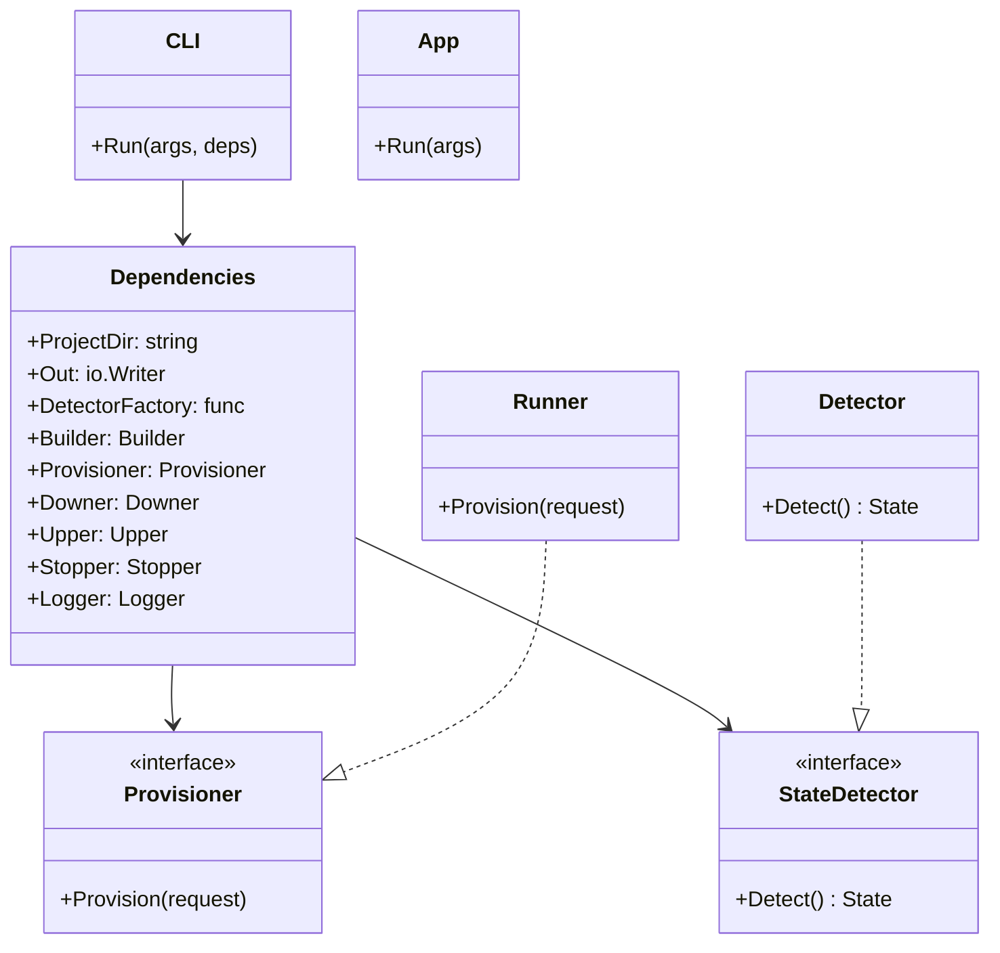
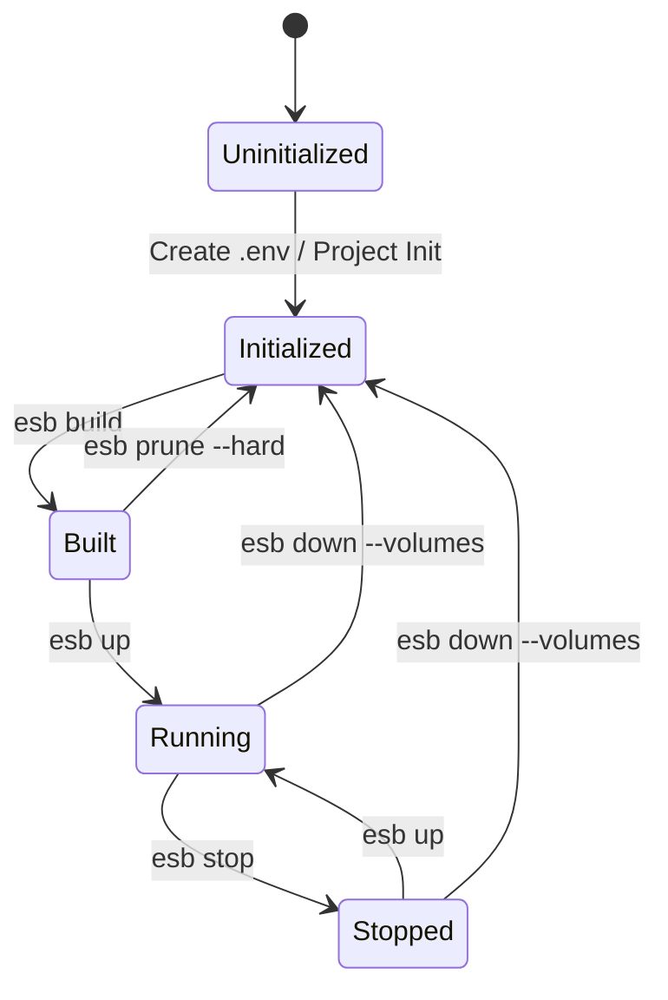

# ESB CLI Architecture

## Overview

The Edge Serverless Box (ESB) CLI is a Go-based command-line tool designed to manage local serverless environments using Docker and AWS SDKs. It follows a layered architecture to ensure testability, modularity, and clean separation of concerns.

## System Architecture

The following diagram illustrates the high-level components and their interactions.

```mermaid
graph TD
    User[User] --> CLI[ESB CLI Entrypoint]

    subgraph "Internal Application Layer"
        CLI --> App[App Logic (Dispatch)]
        App --> Dependencies[Dependency Injection]

        Dependencies --> Builder[Builder]
        Dependencies --> Provisioner[Provisioner]
        Dependencies --> StateDetector[State Detector]
        Dependencies --> ComposeAdapter[Compose Adapter]
    end

    subgraph "External Systems"
        Builder --> Gen[Code Generator]
        ComposeAdapter --> Docker[Docker Daemon]
        Provisioner --> AWS[AWS Local Services (DynamoDB/S3)]
        App --> FS[File System (.env, config)]
    end

    App -->|Read| FS
    StateDetector -->|Query| Docker
    StateDetector -->|Check| FS
```

## Internal Class Structure

The core of the CLI is built around the `Dependencies` struct, which aggregates all necessary services. This allows for easy mocking during tests.



## State Machine

The CLI manages the lifecycle of the local environment through a defined set of states. The `StateDetector` determines the current state based on file system artifacts and Docker container status.

### States

- **Uninitialized**: No valid project context (e.g., missing `.env` or project directory).
- **Initialized**: Valid context, but no build artifacts or containers exist.
- **Built**: Build artifacts (Dockerfiles, generated code) exist, but no containers are created.
- **Stopped**: Containers exist but are not running.
- **Running**: One or more containers are in the "running" state.

### State Transitions



## Key Components

### 1. State Detector (`cli/internal/state`)
Orchestrates state detection by combining:
- **Context Resolution**: Checks for project validity.
- **Container Checks**: Queries Docker for running/stopped containers.
- **Artifact Verification**: Checks for generated files in `output/`.

### 2. Provisioner (`cli/internal/provisioner`)
Handles the setup of local AWS resources.
- Parses SAM templates (`template.yaml`).
- Configures local DynamoDB tables and S3 buckets.
- Uses `aws-sdk-go-v2` to communicate with local containers.

### 3. Application Logic (`cli/internal/app`)
Contains the business logic for each command (`up`, `down`, `build`, etc.). It acts as the glue between the CLI interface (Kong) and the internal adapters.
