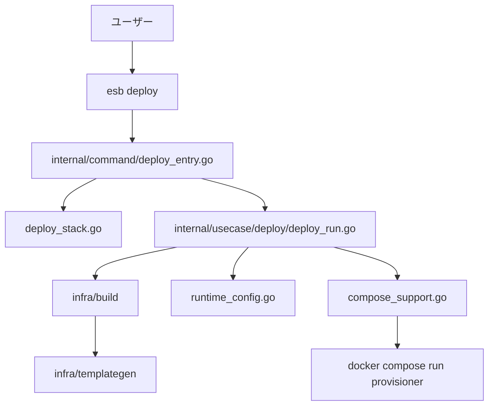

<!--
Where: cli/docs/architecture.md
What: Deploy-first CLI architecture and behavior contracts.
Why: Reflect WS2 split responsibilities and runtime sync semantics.
-->
# CLI アーキテクチャ（deploy-first）

## 概要
CLI は **`deploy` を主コマンド**として設計されています。
`deploy` は SAM テンプレート解析から config 生成、イメージ build、runtime-config 同期、
provisioner 実行までを 1 ワークフローで扱います。

補助コマンド:
- `version`（ビルド情報の表示）

## 全体フロー

## レイヤ構成
| レイヤ | パッケージ | 役割 |
| --- | --- | --- |
| Entry | `cli/cmd/esb` | Kong ベースの CLI 起動とコマンド配線 |
| Wiring | `cli/internal/app` | 依存注入（DI） |
| Command | `cli/internal/command` | 入力解決、対話、事前検証、エラー整形 |
| Usecase | `cli/internal/usecase/deploy` | deploy 手順の順序制御 |
| Domain | `cli/internal/domain/*` | テンプレート/差分/ランタイム推論の純粋ロジック |
| Infra | `cli/internal/infra/*` | Docker/Compose/FS/Env/UI/SAM など I/O |

## WS2 で分割した責務
| ファイル | 責務 |
| --- | --- |
| `cli/internal/command/deploy_entry.go` | deploy エントリと実行順序制御 |
| `cli/internal/command/deploy_inputs_resolve.go` | deploy 入力解決（project/env/mode/template） |
| `cli/internal/command/deploy_inputs_env_mode.go` | env/mode の対話・正規化 |
| `cli/internal/command/deploy_inputs_compose.go` | compose file 正規化 |
| `cli/internal/command/deploy_inputs_output.go` | output directory 決定 |
| `cli/internal/command/deploy_template_resolve.go` | template 選択フロー |
| `cli/internal/command/deploy_template_discovery.go` | template path 正規化・探索 |
| `cli/internal/command/deploy_template_prompt.go` | SAM parameter 抽出・入力 |
| `cli/internal/command/deploy_stack.go` | 実行中 stack 検出、`mode` 推論、優先順位付き stack 選択 |
| `cli/internal/usecase/deploy/deploy.go` | `Request`/`Workflow` 契約とDI境界 |
| `cli/internal/usecase/deploy/deploy_run.go` | `Workflow.Run` のフェーズ順序制御 |
| `cli/internal/usecase/deploy/deploy_registry_wait.go` | registry待機とprobe URL解決 |
| `cli/internal/usecase/deploy/deploy_build_phase.go` | build request 構築と build 実行 |
| `cli/internal/usecase/deploy/deploy_postbuild_summary.go` | build後の差分サマリ表示 |
| `cli/internal/usecase/deploy/deploy_runtime_provision.go` | image prewarm / runtime sync / provisioner |
| `cli/internal/usecase/deploy/image_prewarm.go` | prewarm manifest 解釈と `--image-prewarm` 正規化 |
| `cli/internal/usecase/deploy/gateway_runtime.go` | gateway 実行環境の整合（project/network 補正） |
| `cli/internal/usecase/deploy/runtime_config.go` | staging config の runtime target 同期 |
| `cli/internal/usecase/deploy/compose_support.go` | compose file 解決、サービス存在検証、provisioner 実行 |
| `cli/internal/infra/deploy/compose_provisioner.go` | provisioner 実行オーケストレーション |
| `cli/internal/infra/deploy/compose_provisioner_status.go` | gateway/agent(runtime-node) 稼働警告判定 |
| `cli/internal/infra/deploy/compose_provisioner_composefiles.go` | compose file 解決・required service 検証 |
| `cli/internal/infra/env/env_defaults.go` | runtime env セットアップのエントリ順序 |
| `cli/internal/infra/env/env_defaults_*.go` | branding/proxy/network/registry/configdir の責務分離 |
| `cli/internal/infra/fileops/file_ops.go` | build/templategen 共通の FS helper |
| `cli/internal/infra/build/go_builder.go` | build オーケストレーション本体 |
| `cli/internal/infra/build/go_builder_generate_stage.go` | generator 実行 + staging コピー |
| `cli/internal/infra/build/go_builder_base_images.go` | base image bake フェーズ |
| `cli/internal/infra/build/go_builder_registry_config.go` | registry解決・待機・push先判定 |
| `cli/internal/infra/build/go_builder_functions.go` | function image build と tag/label 補助 |
| `cli/internal/infra/build/go_builder_ca.go` | root CA path/fingerprint 解決 |
| `cli/internal/infra/build/go_builder_lock.go` | build lock 制御 |
| `cli/internal/infra/build/bake_exec.go` | buildx bake 実行、lock、エラー整形 |
| `cli/internal/infra/build/bake_hcl.go` | bake HCL 生成 |
| `cli/internal/infra/build/bake_outputs.go` | output/provenance 判定 |
| `cli/internal/infra/build/bake_builder.go` | buildx builder 検証・再作成 |
| `cli/internal/infra/build/bake_args.go` | `--allow=fs.read` / secret path 解決 |
| `cli/internal/infra/build/bake_proxy.go` | buildx builder の proxy 設定解決 |
| `cli/internal/infra/build/merge_config_entry.go` | staging config merge の順序制御 |
| `cli/internal/infra/build/merge_config_yaml.go` | `functions/routing/resources` の YAML merge |
| `cli/internal/infra/build/merge_config_image_import.go` | `image-import.json` merge |
| `cli/internal/infra/build/merge_config_lock_io.go` | lock と atomic IO |
| `cli/internal/infra/sam/template_functions_*.go` | SAM関数解析（dispatch/serverless/lambda/events/layers） |
| `cli/internal/infra/sam/intrinsics_resolver.go` | Intrinsic resolver の状態管理と shared helper |
| `cli/internal/infra/sam/intrinsics_resolve_dispatch.go` | `Ref/Fn::*` 解決ディスパッチ |
| `cli/internal/infra/sam/intrinsics_conditions.go` | Condition 評価とキャッシュ |
| `cli/internal/infra/sam/intrinsics_warnings.go` | warning 重複排除と集約 |
| `cli/internal/infra/templategen/generate.go` | generator の parse/stage/render オーケストレーション |
| `cli/internal/infra/templategen/generate_paths.go` | template/output/config path 解決 |
| `cli/internal/infra/templategen/generate_params.go` | parameter merge / tag / function sort |
| `cli/internal/infra/templategen/stage.go` | function staging の core フロー |
| `cli/internal/infra/templategen/stage_layers.go` | layer staging と layer 名正規化 |
| `cli/internal/infra/templategen/stage_paths.go` | resource/sitecustomize path 解決 |
| `cli/internal/infra/templategen/bundle_manifest.go` | bundle manifest の書き込みフローと image 収集 |
| `cli/internal/infra/templategen/bundle_manifest_types.go` | bundle manifest schema と input contract |
| `cli/internal/infra/templategen/bundle_manifest_helpers.go` | git/hash/path/parameter helper |

## 入力解決（`deploy`）
`deploy_inputs_resolve.go` を中心に以下の順で入力を決定します。

1. repo root 解決（CWD 基準）
2. project 名解決（`--project` -> env -> host env -> 実行中 stack -> default）
3. env 解決（`--env` / stack 情報 / 過去入力）
4. mode 推論（running services -> services -> compose config files）
5. template 解決（flag / interactive / recent defaults）
6. parameter・output・compose override を統合

複数テンプレート指定時は先行テンプレートを `build-only` として実行し、
最終テンプレートで `provisioner` まで実行します。

## runtime-config 同期の仕様
`runtime_config.go` は staging 出力を `compose_project` に紐づく runtime target に同期します。
この同期は **通常 deploy のみ**で実行され、`build-only` では実行されません。

同期対象ファイル:
- `functions.yml`
- `routing.yml`
- `resources.yml`
- `image-import.json`

同期ターゲット解決順:
1. gateway の `/app/runtime-config` が bind mount なら bind path にコピー
2. volume mount なら volume へコピー
3. mount が不明な場合は gateway container へ `docker cp`

エラー契約:
- container copy と volume copy の両方が失敗した場合は **結合して失敗を返す**
- 同期失敗は warning ではなく deploy 全体を失敗として返す

## compose/provisioner 実行の仕様
`compose_support.go` は provisioner 実行前に compose セットを確定します。
`provisioner` 実行は **通常 deploy のみ**で、`build-only` ではスキップされます。

優先順位:
1. `--compose-file` 指定
2. 実行中 project から compose files を逆引き
3. mode 既定 (`docker-compose.docker.yml` / `docker-compose.containerd.yml` + proxy compose)

実行前検証:
- `provisioner`, `database`, `s3-storage`, `victorialogs` の存在確認
- 欠落時は即時エラー

## buildx bake 実行の仕様
`bake_exec.go` / `bake_hcl.go` / `bake_outputs.go` / `bake_builder.go` / `bake_args.go` /
`bake_proxy.go` は次を担います。

- ターゲット群を一時 `docker-bake.hcl` にレンダリング
- builder を固定名で利用（`BUILDX_BUILDER` または `<slug>-buildx`）
- provenance 設定を `PROVENANCE` で制御
- public ECR 認証失敗の補助ヒントを付与
- Docker config / env から proxy 値を吸い上げて buildx builder と整合

## 設定ファイルと保存先
- **グローバル設定**: `<repo_root>/.<brand>/config.yaml`
  - 最近テンプレート履歴 (`recent_templates`)
  - テンプレート別 defaults (`build_defaults`)
- **staging 設定**: `<repo_root>/.<brand>/staging/<compose_project>/<env>/config`
  - `functions.yml` / `routing.yml` / `resources.yml` / `image-import.json`
- **ビルド出力**: `<template_dir>/.<brand>/<env>/...`（`--output` 指定で変更）

> repo root は CWD から上方向に
> `docker-compose.docker.yml` / `docker-compose.containerd.yml` を探索して決定します。

---

## Implementation references
- `cli/internal/command/deploy.go`
- `cli/internal/command/deploy_entry.go`
- `cli/internal/command/deploy_inputs_resolve.go`
- `cli/internal/command/deploy_inputs_env_mode.go`
- `cli/internal/command/deploy_inputs_compose.go`
- `cli/internal/command/deploy_inputs_output.go`
- `cli/internal/command/deploy_template_resolve.go`
- `cli/internal/command/deploy_template_discovery.go`
- `cli/internal/command/deploy_template_prompt.go`
- `cli/internal/command/deploy_defaults.go`
- `cli/internal/command/deploy_summary.go`
- `cli/internal/command/deploy_stack.go`
- `cli/internal/usecase/deploy/deploy.go`
- `cli/internal/usecase/deploy/deploy_run.go`
- `cli/internal/usecase/deploy/deploy_registry_wait.go`
- `cli/internal/usecase/deploy/deploy_build_phase.go`
- `cli/internal/usecase/deploy/deploy_postbuild_summary.go`
- `cli/internal/usecase/deploy/deploy_runtime_provision.go`
- `cli/internal/usecase/deploy/image_prewarm.go`
- `cli/internal/usecase/deploy/runtime_config.go`
- `cli/internal/usecase/deploy/runtime_config_test.go`
- `cli/internal/usecase/deploy/compose_support.go`
- `cli/internal/usecase/deploy/gateway_runtime.go`
- `cli/internal/infra/deploy/compose_provisioner.go`
- `cli/internal/infra/deploy/compose_provisioner_status.go`
- `cli/internal/infra/deploy/compose_provisioner_composefiles.go`
- `cli/internal/infra/env/env_defaults.go`
- `cli/internal/infra/env/env_defaults_branding.go`
- `cli/internal/infra/env/env_defaults_proxy.go`
- `cli/internal/infra/env/env_defaults_network.go`
- `cli/internal/infra/env/env_defaults_registry.go`
- `cli/internal/infra/env/env_defaults_configdir.go`
- `cli/internal/infra/fileops/file_ops.go`
- `cli/internal/infra/build/bake.go`
- `cli/internal/infra/build/bake_exec.go`
- `cli/internal/infra/build/bake_hcl.go`
- `cli/internal/infra/build/bake_outputs.go`
- `cli/internal/infra/build/bake_builder.go`
- `cli/internal/infra/build/bake_args.go`
- `cli/internal/infra/build/bake_proxy.go`
- `cli/internal/infra/build/merge_config_entry.go`
- `cli/internal/infra/build/merge_config_yaml.go`
- `cli/internal/infra/build/merge_config_image_import.go`
- `cli/internal/infra/build/merge_config_lock_io.go`
- `cli/internal/infra/build/merge_config_helpers.go`
- `cli/internal/infra/build/go_builder.go`
- `cli/internal/infra/build/go_builder_generate_stage.go`
- `cli/internal/infra/build/go_builder_base_images.go`
- `cli/internal/infra/build/go_builder_registry_config.go`
- `cli/internal/infra/build/go_builder_functions.go`
- `cli/internal/infra/build/go_builder_ca.go`
- `cli/internal/infra/build/go_builder_lock.go`
- `cli/internal/infra/sam/template_functions_parse.go`
- `cli/internal/infra/sam/template_functions_serverless.go`
- `cli/internal/infra/sam/template_functions_lambda.go`
- `cli/internal/infra/sam/template_functions_events_scaling.go`
- `cli/internal/infra/sam/template_functions_layers_runtime.go`
- `cli/internal/infra/sam/template_functions_test.go`
- `cli/internal/infra/templategen/stage.go`
- `cli/internal/infra/templategen/stage_layers.go`
- `cli/internal/infra/templategen/stage_paths.go`
- `cli/internal/infra/templategen/generate.go`
- `cli/internal/infra/templategen/generate_paths.go`
- `cli/internal/infra/templategen/generate_params.go`
- `cli/internal/infra/templategen/bundle_manifest.go`
- `cli/internal/infra/templategen/bundle_manifest_types.go`
- `cli/internal/infra/templategen/bundle_manifest_helpers.go`
- `cli/docs/architecture-review-cli.md`
