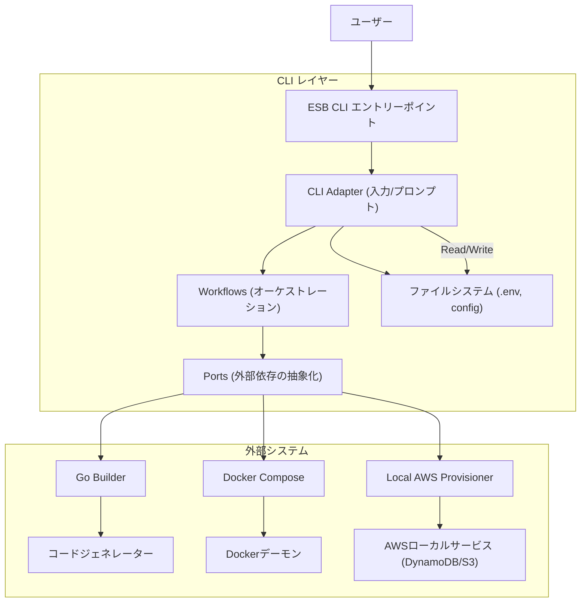
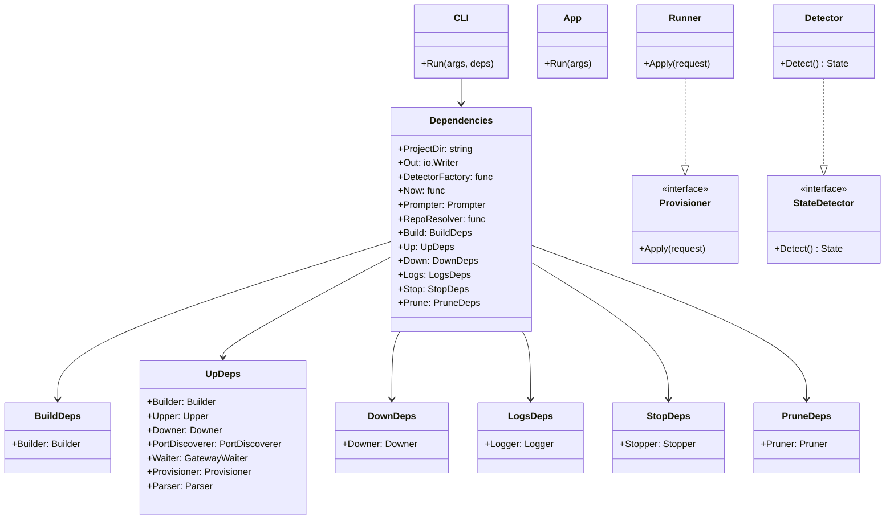
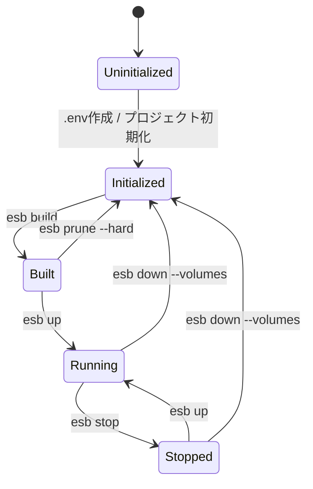

# ESB CLI アーキテクチャ

## 概要

Edge Serverless Box (ESB) CLIは、DockerとAWS SDKを使用してローカルのサーバーレス環境を管理するために設計されたGoベースのコマンドラインツールです。CLIアダプタ（入力/プロンプト）とワークフロー（オーケストレーション）、ポート（外部依存の抽象化）を分離した階層化アーキテクチャを採用しています。

## システムアーキテクチャ

以下の図は、高レベルのコンポーネントとその相互作用を示しています。

## 内部クラス構造

CLIの中核は、共有の依存とコマンド別の依存を束ねる `Dependencies` 構造体を中心に構築されています。これにより、テスト時のモック化が容易になります。

## ステートマシン

CLIは、定義された状態セットを通じてローカル環境のライフサイクルを管理します。`StateDetector` は、ファイルシステムの成果物とDockerコンテナの状態に基づいて現在の状態を決定します。

### 状態定義

- **Uninitialized (未初期化)**: 有効なプロジェクトコンテキストが存在しない状態（例: `.env` やプロジェクトディレクトリの欠如）。
- **Initialized (初期化済み)**: コンテキストは有効だが、ビルド成果物やコンテナが存在しない状態。
- **Built (ビルド済み)**: ビルド成果物（Dockerfile、生成されたコード）は存在するが、コンテナは作成されていない状態。
- **Stopped (停止中)**: コンテナは存在するが、稼働していない状態。
- **Running (稼働中)**: 1つ以上のコンテナが「running」状態にある。

### 状態遷移図

## 主要コンポーネント

### 1. State Detector (`cli/internal/state`)
以下の要素を組み合わせて状態検出をオーケストレーションします。
- **コンテキスト解決**: プロジェクトの有効性をチェックします。
- **コンテナチェック**: Dockerに対して稼働中/停止中のコンテナを問い合わせます。
- **成果物検証**: `output/` ディレクトリ内の生成ファイルを確認します。

### 2. Provisioner (`cli/internal/provisioner`)
ローカルAWSリソースのセットアップを処理します。
- SAMテンプレート (`template.yaml`) の解析。
- ローカルDynamoDBテーブルおよびS3バケットの設定。
- `aws-sdk-go-v2` を使用したローカルコンテナとの通信。

### 3. Command Adapters (`cli/internal/commands`)
各コマンド (`up`, `down`, `build`, `env`, `project` など) の入力解決を担うCLIアダプタです。実際のオーケストレーションは `cli/internal/workflows` に移り、外部依存は `cli/internal/ports` を介して呼び出します。共通処理は `cli/internal/helpers` に集約され、対話入力は `cli/internal/interaction` が担当します。

### 4. Workflows (`cli/internal/workflows`)
コマンドの手順をオーケストレーションする層です。`build`/`up`/`down`/`logs`/`stop`/`prune`/`env`/`project` の各ワークフローが、DTOを受け取り `ports` を通じて外部依存を呼び出します。

### 5. Ports (`cli/internal/ports`)
外部依存を抽象化するインターフェース群です。`Builder`/`Upper`/`Downer`/`Logger`/`Provisioner`/`RuntimeEnvApplier`/`UserInterface` などを提供し、ワークフローのテスト容易性を高めます。
