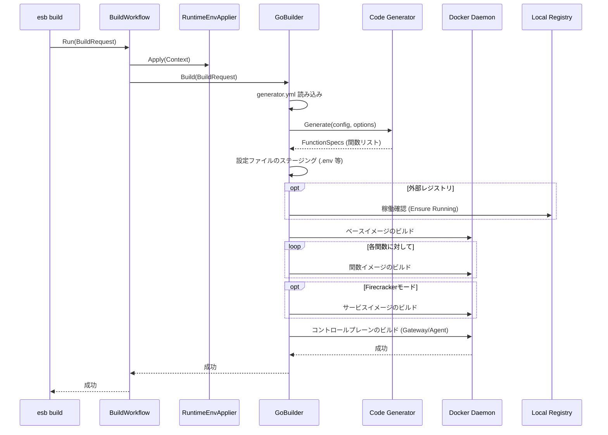

# `esb build` コマンド

## 概要

`esb build` コマンドは、サーバーレスプロジェクトの成果物をコンパイルします。SAMテンプレート (`template.yaml`) と `generator.yml` 設定ファイルを解析し、各Lambda関数用のDockerfileを生成して、対応するDockerイメージをビルドします。

## 使用方法

```bash
esb build [flags]
```

### フラグ

| フラグ | 短縮形 | 説明 |
|--------|--------|------|
| `--env` | `-e` | ターゲット環境 (例: local, dev)。デフォルトは最後に使用された環境です。 |
| `--template` | `-t` | SAMテンプレートへのパス。 |
| `--no-cache` | | イメージビルド時にキャッシュを使用しません。 |
| `--verbose` | `-v` | 詳細な出力を有効にします。デフォルトでは進行状況のみを表示する静音モードです。 |
| `--force` | | 無効な `ESB_PROJECT`/`ESB_ENV` 環境変数を自動的に解除します。 |

## 実装詳細

CLIアダプタは `cli/internal/commands/build.go` にあり、オーケストレーションは `cli/internal/workflows/build.go` が担当します。実際のビルド処理は `cli/internal/generator/go_builder.go` (GoBuilder) に委譲されます。

### 主要コンポーネント

- **`BuildWorkflow`**: ランタイム環境適用とBuilder呼び出しを行うオーケストレーター。
- **`BuildRequest`**: CLI から Workflow に渡される入力DTO。
- **`RuntimeEnvApplier`**: `applyRuntimeEnv` を通じてESB環境変数を適用。
- **`UserInterface`**: 成功メッセージの出力（互換のため `LegacyUI` を使用）。
- **`GoBuilder`**: `ports.Builder` インターフェースの実装。
  - **`Generate`**: ビルド成果物 (Dockerfiles, ハンドララッパー) を `output/<env>/` に生成します。
  - **`BuildCompose`**: コントロールプレーンのイメージ (Gateway, Agent) をビルドします。
  - **`Runner`**: ベースイメージと関数イメージに対して `docker build` コマンドを実行します。

### ビルドロジック

1. **コンテキスト解決**: プロジェクトディレクトリとアクティブな環境を決定します。
2. **ランタイム環境適用**: `RuntimeEnvApplier` が `ESB_*` 変数を適用します。
3. **設定読み込み**: `generator.yml` を読み込み、関数のマッピングとパラメータを理解します。
4. **コード生成**:
   - `template.yaml` を解析します。
   - ボイラープレートコード (Python/Node.jsハンドラなど) とDockerfileを生成します。
   - `output/<env>/` に出力します。
5. **イメージビルド**:
   - ローカルレジストリが稼働していることを確認します (必要な場合)。
   - ベースイメージ (共有レイヤー) をビルドします。
   - 個別の関数イメージをビルドします。
   - サービスイメージをビルドします (Firecrackerモードの場合)。
   - コントロールプレーン (Gateway/Agent) をDocker Compose経由でビルドします。

## シーケンス図


