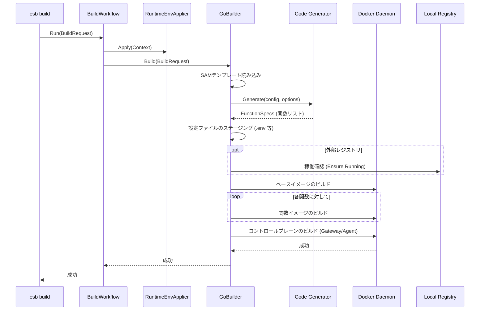

# `esb build` コマンド

## 概要

`esb build` コマンドは、サーバーレスプロジェクトの成果物をコンパイルします。SAMテンプレート (`template.yaml`) を解析し、各Lambda関数用のDockerfileを生成して、対応するDockerイメージをビルドします。`generator.yml` は参照しません。

## 使用方法

```bash
esb build --template <path> --env <name> --mode <docker|containerd> [flags]
```

### フラグ

| フラグ | 短縮形 | 説明 |
|--------|--------|------|
| `--env` | `-e` | ターゲット環境名（必須）。未指定時は対話入力。 |
| `--env-file` | | 読み込む `.env` ファイルパス（任意）。未指定時はカレントディレクトリの `.env` を自動で読み込みます。 |
| `--mode` | `-m` | ランタイムモード（必須）。未指定時は対話入力。 |
| `--template` | `-t` | SAMテンプレートへのパス（必須）。未指定時は対話入力。 |
| `--output` | `-o` | 生成物の出力先（任意）。未指定時は `<template_dir>/.<brand>/<env>` を使用。 |
| `--no-cache` | | イメージビルド時にキャッシュを使用しません。 |
| `--verbose` | `-v` | 詳細な出力を有効にします。デフォルトでは進行状況のみを表示する静音モードです。 |
| `--force` | | 無効な `<BRAND>_PROJECT`/`<BRAND>_ENV` 環境変数を自動的に解除します。 |

## 実装詳細

CLIアダプタは `cli/internal/commands/build.go` にあり、オーケストレーションは `cli/internal/workflows/build.go` が担当します。実際のビルド処理は `cli/internal/generator/go_builder.go` (GoBuilder) に委譲されます。

### 主要コンポーネント

- **`BuildWorkflow`**: ランタイム環境適用とBuilder呼び出しを行うオーケストレーター。
- **`BuildRequest`**: CLI から Workflow に渡される入力DTO（Workflow 内で `generator.BuildRequest` に変換）。
- **`RuntimeEnvApplier`**: `applyRuntimeEnv` を通じて `ENV_PREFIX` 付きの環境変数を適用。
- **`UserInterface`**: 成功メッセージの出力（互換のため `LegacyUI` を使用）。
- **`GoBuilder`**: `ports.Builder` インターフェースの実装。
  - **`Generate`**: ビルド成果物 (Dockerfile, `functions.yml`, `routing.yml`) を出力ディレクトリに生成します。
  - **`BuildCompose`**: コントロールプレーンのイメージ (Gateway, Agent) をビルドします。
  - **`Runner`**: ベースイメージと関数イメージに対して `docker build` コマンドを実行します。

### ビルドロジック

1. **入力解決**: `template` / `env` / `mode` / `output` を解決します。省略された値は対話で補完されます。
2. **ランタイム環境適用**: `RuntimeEnvApplier` が `ENV_PREFIX` 付きの変数を適用します。
3. **パラメータ入力**: SAMテンプレートの `Parameters` が定義されている場合、対話的に入力を求めます（入力値はそのビルドのみ有効）。
4. **コード生成**:
   - `template.yaml` を解析します。
   - Dockerfile と `functions.yml` / `routing.yml` を生成します。
   - 出力ディレクトリ（`output/<env>/` もしくは設定されたパス）に出力します。
5. **イメージビルド**:
   - ローカルレジストリが稼働していることを確認します (必要な場合)。
   - ベースイメージ (共有レイヤー) をビルドします。
   - 個別の関数イメージをビルドします。
   - コントロールプレーン (Gateway/Agent) をDocker Compose経由でビルドします。

## シーケンス図


