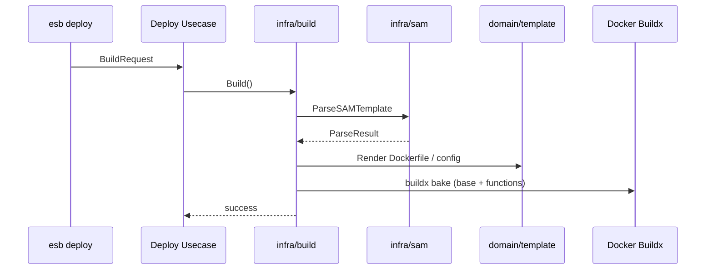

# ビルドパイプライン（deploy 内部）

## 概要
`esb deploy` は内部でビルドパイプラインを実行します。SAM テンプレートを解析し、
`functions.yml` / `routing.yml` / `resources.yml` と各関数の Dockerfile を生成した上で、
**関数イメージのみ**をビルドします（コントロールプレーンは Docker Compose 側でビルド）。

## 入力

ビルド処理は `build.BuildRequest` で駆動されます。主なフィールド:
- `TemplatePath` / `ProjectDir`
- `Env` / `Mode` / `Tag`
- `OutputDir` / `Parameters` / `NoCache` / `Verbose`

`deploy` の入力解決が完了すると、usecase がこのリクエストを組み立てて `infra/build` に渡します。

## 出力

- `functions.yml` / `routing.yml` / `resources.yml`
- 各関数の `Dockerfile`
- 関数ごとのビルドコンテキスト (`functions/<name>/...`)

デフォルトの出力先は以下です:
- `<template_dir>/.<brand>/<env>/...`
- `--output` 指定時は `<template_dir>/<output>/<env>/...`

## ビルドフロー

## 詳細ステップ

1. **テンプレート解決**
   - `TemplatePath` を絶対パス化
   - `Parameters.Default` と CLI 入力値を統合（CLI が優先）

2. **SAM 解析**
   - `infra/sam` で Intrinsic 解決
   - `FunctionSpec` と `manifest.ResourcesSpec` を生成

3. **ステージング**
   - 関数コードを `functions/<name>/src` にコピー
   - Layer を `functions/<name>/layers/<layer>` へ展開
   - `sitecustomize.py` をコピー/リンク

4. **設定ファイル生成**
   - `functions.yml` / `routing.yml` / `resources.yml` を出力

5. **staging config への反映**
   - `<template_dir>/.<brand>/staging/<compose_project>/<env>/config` にマージ
   - `.deploy.lock` で排他制御

6. **ベースイメージのビルド**
   - `esb-lambda-base` / `esb-os-base` / `esb-python-base`
   - 既存イメージが最新の場合はスキップ

7. **関数イメージのビルド**
   - 画像名は関数名から Docker 安全名へ正規化
   - 画像フィンガープリントが一致する場合はスキップ

## イメージ命名規則

- ベース: `esb-lambda-base:<tag>` / `esb-os-base:latest` / `esb-python-base:latest`
- 関数: `esb-<sanitized-function-name>:<tag>`

`sanitized-function-name` は英小文字/数字/`._-` のみを許容し、
それ以外は `-` に変換します。衝突した場合はエラーで停止します。

## レジストリの扱い

- 実行時のレジストリは `CONTAINER_REGISTRY` を参照
- ホスト側の待機には `HOST_REGISTRY_ADDR` / `PORT_REGISTRY` を使用
- `ESB_REGISTRY_WAIT=0` でレジストリ待機を無効化可能

## ZIP レイヤ展開の安全性

Layer の ZIP 展開には以下の安全対策があります:
- **パストラバーサル防止**: 展開先が `layer cache` 配下であることを検証
- **サイズ上限**: 1 エントリあたり **200 MiB** を超える場合はエラー

## 付記
- deploy は **関数イメージのみ**をビルドします。
- Control-plane（Gateway/Agent/Provisioner/Runtime Node）は Docker Compose 側でビルドされます。
- `BuildRequest.Bundle=true` の場合、bundle 用 manifest を生成します（内部用途）。
