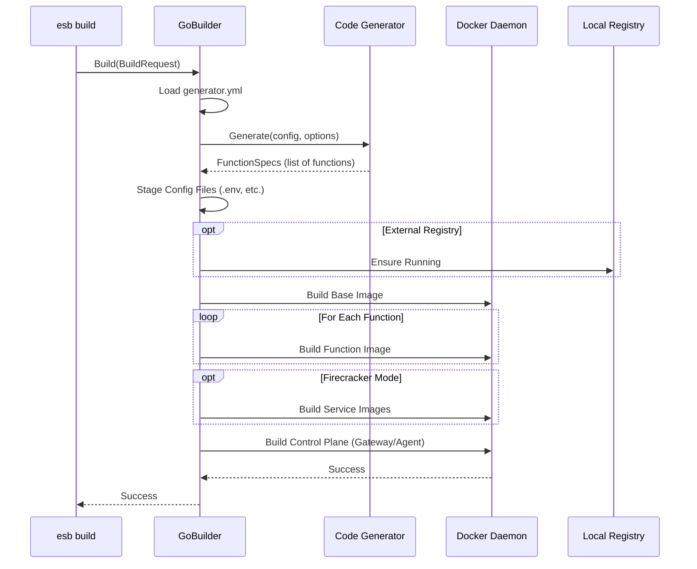

# `esb build` Command

## Overview

The `esb build` command compiles the serverless project artifacts. It analyzes the SAM template (`template.yaml`) and the `generator.yml` configuration to generate Dockerfiles for each Lambda function and builds the corresponding Docker images.

## Usage

```bash
esb build [flags]
```

### Flags

| Flag | Short | Description |
|------|-------|-------------|
| `--env`, `-e` | | Target environment (e.g., local, dev). Defaults to last used. |
| `--template`, `-t` | | Path to SAM template. |
| `--no-cache` | | Do not use cache when building images. |
| `--verbose`, `-v` | | Enable verbose output. |
| `--force` | | Auto-unset invalid `ESB_PROJECT`/`ESB_ENV` variables. |

## Implementation Details

The command logic is implemented in `cli/internal/app/build.go` and delegates the heavy lifting to `cli/internal/generator/go_builder.go`.

### Key Components

- **`BuildRequest`**: Struct capturing command-line arguments.
- **`GoBuilder`**: Implementation of the `Builder` interface.
  - **`Generate`**: Generates build artifacts (Dockerfiles, handler wrappers) into `output/<env>/`.
  - **`BuildCompose`**: Builds the control plane images (Gateway, Agent).
  - **`Runner`**: Executes `docker build` commands for base images and function images.

### Build Logic

1. **Context Resolution**: Determines project directory and active environment.
2. **Configuration Loading**: Reads `generator.yml` to understand function mappings and parameters.
3. **Code Generation**:
   - Parses `template.yaml`.
   - Generates boilerplate code (e.g., Python/Node.js handlers) and Dockerfiles.
   - Outputs to `output/<env>/`.
4. **Image Building**:
   - Ensures the local registry is running (if required).
   - Builds the Base Image (shared layers).
   - Builds individual Function Images.
   - Builds Service Images (if in Firecracker mode).
   - Builds Control Plane (Gateway/Agent) via Docker Compose.

## Sequence Diagram


