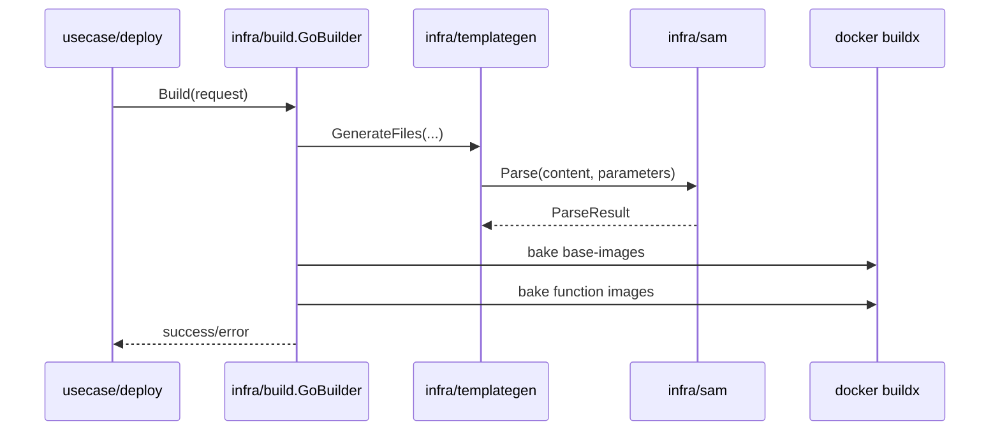

<!--
Where: docs/build.md
What: Build pipeline behavior and extension rules for deploy.
Why: Keep build-phase implementation and developer changes aligned.
-->
# ビルドパイプライン（deploy 内部）

## 概要
`esb deploy` は `internal/infra/build` の `GoBuilder` を通して、次を順に実行します。

1. 生成（templategen）
2. base image build
3. function image build
4. （任意）bundle manifest 出力

`control-plane` イメージ（gateway/agent/provisioner/runtime-node）は deploy では直接ビルドしません（`docker compose` 側で管理）。

## 主要コンポーネント

- オーケストレーション: `internal/infra/build/go_builder.go`
- フェーズ進捗表示: `internal/infra/build/go_builder_phase.go`
- テンプレート生成: `internal/infra/templategen/generate.go`
- buildx 実行: `internal/infra/build/bake_exec.go`
- runtime-config apply（apply phase）: `pkg/artifactcore/apply.go`

## 実行フロー



## 入力契約（抜粋）
`internal/infra/build.BuildRequest` の主要項目:

- `ProjectDir`, `ProjectName`
- `TemplatePath`, `OutputDir`
- `Env`, `Mode`, `Tag`
- `Parameters`
- `ImageSources`, `ImageRuntimes`
- `NoCache`, `Verbose`, `BuildImages`, `Bundle`, `Emoji`

## 失敗契約

- 必須入力不足（`TemplatePath`, `Env`, `Mode`, `Tag`）は即時エラー
- generator/buildx の失敗は deploy 全体を失敗として返却
- `Bundle=true` かつ writer 未注入はエラー

## 拡張ポイント

### 1. 新しい base image ターゲットを追加
1. `docker-bake.hcl` に target/group を追加
2. `internal/infra/build/go_builder_base_images.go` に組み込む
3. 必要なら fingerprint/label 管理を更新
4. テスト: `internal/infra/build/go_builder_test.go`

### 2. 関数イメージ build 条件を変更
1. `internal/infra/build/go_builder_functions.go` を更新
2. `template.FunctionSpec` の解釈（`ImageSource`, runtime など）を確認
3. テスト: `internal/infra/build/go_builder_test.go`

### 3. runtime-config 出力ファイルを追加
1. `internal/infra/templategen/generate.go` の出力対象を更新
2. `pkg/artifactcore/merge.go` 側のマージ対象も更新
3. テスト: `internal/infra/templategen/generate_test.go`

## 変更時の最小テスト

```bash
go test ./internal/infra/build ./internal/infra/templategen ./internal/usecase/deploy -count=1
```
