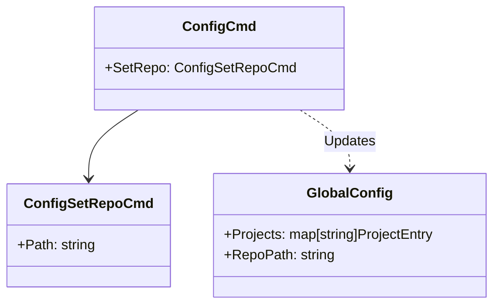

# `esb config` Command

## Overview

The `esb config` command allows modification of the global CLI configuration, such as the location of the internal ESB repository (used for base images and templates).

## Usage

```bash
esb config [command] [flags]
```

### Subcommands

| Command | Description |
|---------|-------------|
| `set-repo` | Set the path to the ESB repository root. |

## Implementation Details

The command logic is implemented in `cli/internal/app/config_cmd.go`.

### `set-repo`

This command updates the `repo_path` in the global configuration file (`~/.config/esb/config.yaml`).
The CLI uses this path to locate internal assets like Dockerfiles for base images.

### Logic Flow

1. **Resolution**: Resolves the provided path to an absolute path. It attempts to find the true root by searching upwards for marker files (via `config.ResolveRepoRoot`).
2. **Persistence**: Loads the existing global config, updates the `RepoPath` field, and saves it back.

## Class Diagram


