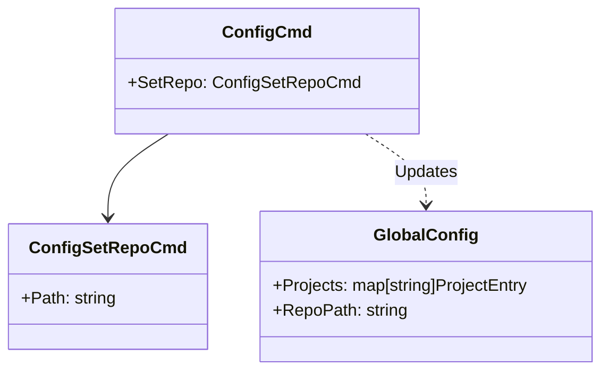

# `esb config` コマンド

## 概要

`esb config` コマンドは、ベースイメージやテンプレートに使用される内部ESBリポジトリの場所など、グローバルなCLI設定を変更することを可能にします。

## 使用方法

```bash
esb config [command] [flags]
```

### サブコマンド

| コマンド | 説明 |
|----------|------|
| `set-repo` | ESBリポジトリルートへのパスを設定します。 |

## 実装詳細

コマンドのロジックは `cli/internal/app/config_cmd.go` に実装されています。

### `set-repo`

このコマンドは、グローバル設定ファイル (`~/.config/esb/config.yaml`) 内の `repo_path` を更新します。
CLIはこのパスを使用して、ベースイメージ用のDockerfileなどの内部アセットを特定します。

### ロジックフロー

1. **解決**: 指定されたパスを絶対パスに解決します。マーカーファイルを求めて上方検索を行い、真のルートを見つけようとします（`config.ResolveRepoRoot` 経由）。
2. **永続化**: 既存のグローバル設定を読み込み、`RepoPath` フィールドを更新して保存します。

## クラス図


