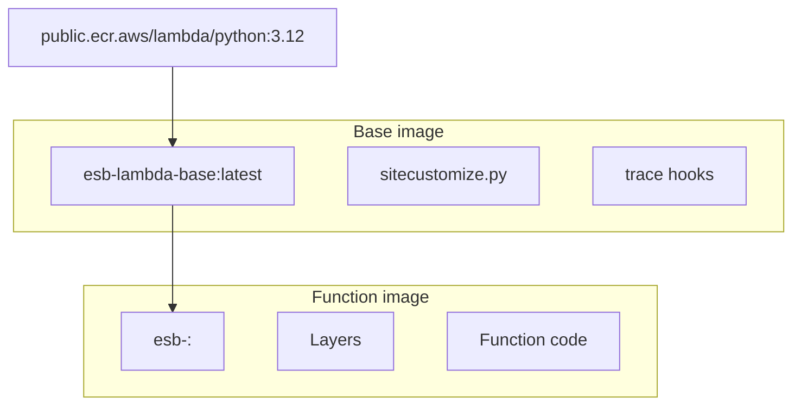
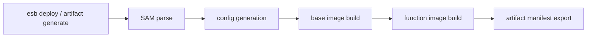
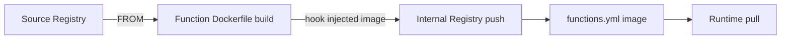

<!--
Where: docs/container-management.md
What: CLI-facing image build and deploy-time image handling.
Why: Keep deploy/artifact behavior clear for CLI feature extension.
-->
# コンテナ管理とイメージ運用（CLI観点）

本ドキュメントは `esb deploy` / `esb artifact generate` / `esb artifact apply` で
CLI が扱う範囲に限定して説明します。

- deploy/generate 時の関数イメージ生成
- image 関数の再ビルド契約
- CLI 変更時の拡張ポイント

## イメージ階層（deploy/generate で扱う範囲）

## deploy/generate 時のビルドフロー

実装:

- `internal/infra/build`
- `internal/infra/templategen`
- `internal/infra/sam`

## Java ランタイムの扱い

- `Runtime: java21` は AWS Lambda Java ベースイメージを使用
- `Handler` は `lambda-java-wrapper.jar` でラップ
- `lambda-java-agent.jar` を `JAVA_TOOL_OPTIONS` で注入

## Image 関数（外部イメージ参照）

`PackageType: Image` の関数は `FROM <ImageUri>` の Dockerfile で常に再ビルドされます。
この再ビルドで runtime hooks（Python `sitecustomize` / Java `javaagent`）が注入されるため、
外部イメージをそのまま pull/tag/push で同期する経路はサポートしません。

イメージ解決の標準経路:

- `esb deploy` / `esb artifact generate`:
  - template 既定の `ImageUri` を基準に `--image-uri` override を適用
  - `--image-runtime` or interactive prompt で runtime を決定
  - 生成された関数イメージを build/push
- `esb artifact apply`:
  - 既存 artifact manifest を適用（build は行わない）

## 拡張プレイブック

### 1. 関数イメージ生成を変更する
1. `internal/infra/templategen/generate.go`
2. `internal/infra/build/go_builder_functions.go`
3. テスト:
   - `internal/infra/templategen/generate_test.go`
   - `internal/infra/build/go_builder_test.go`

### 2. ベースイメージビルド条件を変更する
1. `internal/infra/build/go_builder_base_images.go`
2. `docker-bake.hcl`
3. テスト: `internal/infra/build/go_builder_test.go`

### 3. image runtime 解決ロジックを変更する
1. `internal/command/deploy_image_runtime_prompt.go`
2. `internal/infra/templategen/generate.go`（`resolveImageFunctionRuntime`）
3. テスト:
   - `internal/command/deploy_image_runtime_prompt_test.go`
   - `internal/infra/templategen/generate_test.go`

## Implementation references

- `internal/infra/build`
- `internal/infra/templategen`
- `internal/usecase/deploy/deploy_runtime_provision.go`
