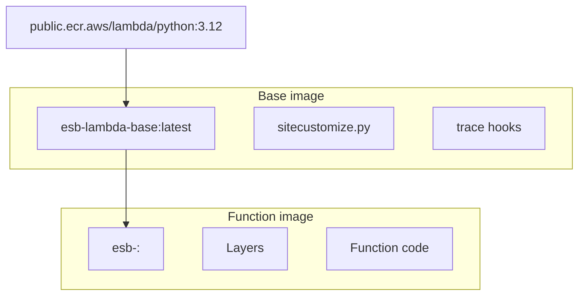
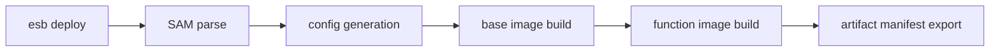
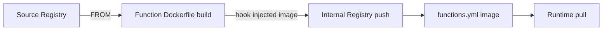

<!--
Where: cli/docs/container-management.md
What: CLI-facing image build and deploy-time image handling.
Why: Keep deploy/build behavior clear for CLI feature extension.
-->
# コンテナ管理とイメージ運用（CLI観点）

本ドキュメントは `esb deploy` / `esb build` で CLI が扱う範囲に限定して説明します。

- deploy 時の関数イメージ生成
- image 関数の再ビルド契約
- CLI 変更時の拡張ポイント

ランタイム運用（Agent/Gateway のライフサイクル、障害対応、ログ確認）は `docs/container-runtime-operations.md` を参照してください。

## イメージ階層（deploy で扱う範囲）

## deploy 時のビルドフロー

実装:
- `cli/internal/infra/build`
- `cli/internal/infra/templategen`
- `cli/internal/infra/sam`

## Java ランタイムの扱い
- `Runtime: java21` は AWS Lambda Java ベースイメージを使用
- `Handler` は `lambda-java-wrapper.jar` でラップ
- `lambda-java-agent.jar` を `JAVA_TOOL_OPTIONS` で注入

## Image 関数（外部イメージ参照）

`PackageType: Image` の関数は `FROM <ImageUri>` の Dockerfile で常に再ビルドされます。
この再ビルドで runtime hooks（Python `sitecustomize` / Java `javaagent`）が注入されるため、
外部イメージを `pull/tag/push` でそのまま同期する経路はサポートしません。

イメージ準備の標準経路:
- CLI deploy 時: `esb deploy` が build phase で関数イメージを build/push
- artifact-only 時: `artifactctl deploy --artifact ... --out ...` が prepare/apply を実行

手動同期用の補助スクリプトは廃止済みです。

## 拡張プレイブック

### 1. 関数イメージ生成を変更する
1. `cli/internal/infra/templategen/generate.go`
2. `cli/internal/infra/build/go_builder_functions.go`
3. テスト:
   - `cli/internal/infra/templategen/generate_test.go`
   - `cli/internal/infra/build/go_builder_test.go`

### 2. ベースイメージビルド条件を変更する
1. `cli/internal/infra/build/go_builder_base_images.go`
2. `docker-bake.hcl`
3. テスト: `cli/internal/infra/build/go_builder_test.go`

---

## Implementation references
- `cli/internal/infra/build`
- `cli/internal/infra/templategen`
- `cli/internal/usecase/deploy/deploy_runtime_provision.go`
