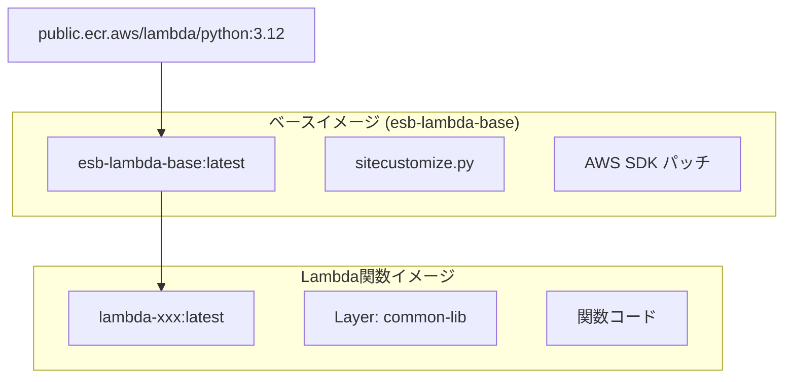

<!--
Where: cli/docs/container-management.md
What: Image build and management overview for CLI deploy/build.
Why: Keep build pipeline and image lifecycle separate from runtime behavior.
-->
# コンテナ管理とイメージ運用

本ドキュメントでは、本基盤の **イメージ構成・ビルド手順**を中心に解説します。
ワーカーのライフサイクルやプール管理は Gateway/Agent 側に移管しました。

## イメージ階層構造

本基盤は効率的なビルドのために、階層化されたイメージ構造を採用しています。



| レイヤー | 内容 | 更新頻度 |
| --- | --- | --- |
| AWS Lambda RIE | 公式Pythonランタイム | 低 |
| `esb-lambda-base` | sitecustomize.py (AWS SDKパッチ) | 低 |
| Lambda関数イメージ | Layers + 関数コード | 高 |

## ビルドプロセス

deploy 実行時に内部ビルドが走り、以下の順序でビルドが行われます。

```mermaid
flowchart LR
    A[esb deploy] --> B[SAM template(s) パース]
    B --> C[設定ファイル生成]
    C --> D[ベースイメージビルド]
    D --> E[Lambda関数イメージビルド]
```

### ベースイメージ (`esb-lambda-base`)

**ソース**: `runtime/python/`

```text
runtime/python/
├── docker/
│   └── Dockerfile
└── extensions/
    ├── trace-bridge/
    │   └── layer/trace_bridge.py
    └── sitecustomize/
        └── site-packages/sitecustomize.py    # AWS SDK パッチ & Direct Logging
```

ベースイメージには以下が含まれます:
- **sitecustomize.py**: Python 起動時に自動ロードされ、AWS SDK の挙動修正とログの送信を行います。

### Lambda関数イメージ

**ソース**: Generator により自動生成

生成される Dockerfile（`CONTAINER_REGISTRY` 設定時はプレフィックス付き、未設定時はローカルイメージ名を使用）:
```dockerfile
# CONTAINER_REGISTRY未設定時の例
FROM esb-lambda-base:latest

# Layer (SAM template で定義)
COPY tests/fixtures/layers/common/ /opt/

# 関数コード
COPY tests/fixtures/functions/xxx/ ${LAMBDA_TASK_ROOT}/

CMD [ "lambda_function.lambda_handler" ]
```

#### Java ランタイム

- `Runtime: java21` は AWS Lambda Java ベースイメージを使用します。
- `Handler` は `lambda-java-wrapper.jar` でラップされ、元の Handler は `LAMBDA_ORIGINAL_HANDLER` に格納されます。
- `lambda-java-agent.jar` が `JAVA_TOOL_OPTIONS` により自動注入され、AWS SDK の挙動変更とログ送信を行います。
- stdout/stderr の VictoriaLogs 送信は javaagent が担当します（`VICTORIALOGS_URL` 設定時）。

## Image 関数（外部イメージ参照）

SAM で `PackageType: Image` を使う関数は、`functions.yml` に以下が出力されます。

- `image`: 実行時に使用する内部レジストリ参照（例: `registry:5010/...`）

同時に `.<brand>/<env>/config/image-import.json` が生成されます。

- `esb deploy --image-prewarm=all`:
  deploy 中に `pull -> tag -> push` の事前同期を実行します。
  prewarm 失敗時は deploy を失敗として終了します（fail-fast）。
- `esb deploy --image-prewarm=off`:
  image 関数が存在するテンプレートではエラー終了します。


手動同期が必要な場合は次を使用します。

```bash
python tools/image-import/import_images.py .<brand>/<env>/config/image-import.json
```

## ライフサイクル（参照先）
ワーカーの起動/削除/プール管理は以下を参照してください:
- Gateway: [services/gateway/docs/architecture.md](../../services/gateway/docs/architecture.md)
- Autoscaling/Janitor: [services/gateway/docs/autoscaling.md](../../services/gateway/docs/autoscaling.md)
- Agent: [services/agent/docs/architecture.md](../../services/agent/docs/architecture.md)

## 運用コマンド

### イメージ管理

```bash
# 全イメージを強制リビルド
esb build --no-cache

# Control-plane イメージを起動
docker compose -f docker-compose.docker.yml up -d
```

### 未使用イメージのクリーンアップ

```bash
# 関連イメージのみをクリーンアップ（推奨）
docker images | grep -E "^(esb-|lambda-)" | awk '{print $3}' | xargs docker rmi

# 全 dangling イメージを削除（注意: 他プロジェクトにも影響）
docker image prune -f
```

### コンテナログの確認

```bash
# Agent のログ（例: esb-prod-agent）
docker logs <project>-agent

# containerd 側の状態確認（namespace は brand 名）
ctr -n <brand> containers list
```

## トラブルシューティング

### 問題: 古いコードが実行される

**原因**: イメージが再ビルドされていない

**解決策**:
```bash
esb build --no-cache
docker compose -f docker-compose.docker.yml up -d
```

### 問題: 大量の `<untagged>` イメージ

**原因**: 頻繁なリビルドによる中間レイヤーの蓄積

**解決策**:
```bash
docker image prune -f
```

### 問題: コンテナが起動しない

**確認手順**:
```bash
# Agent ログの確認
docker logs <project>-agent

# containerd 側の状態確認（namespace は brand 名）
ctr -n <brand> containers list
```

### 問題: Image 関数が `503` で失敗する

**原因**: 内部レジストリに対象イメージが投入されていない

**解決策**:
```bash
# deploy 時に prewarm を必ず有効化
esb deploy --image-prewarm=all

# または手動同期
python tools/image-import/import_images.py .<brand>/<env>/config/image-import.json
```

---

## Implementation references
- `cli/internal/infra/build`
- `runtime/python`
