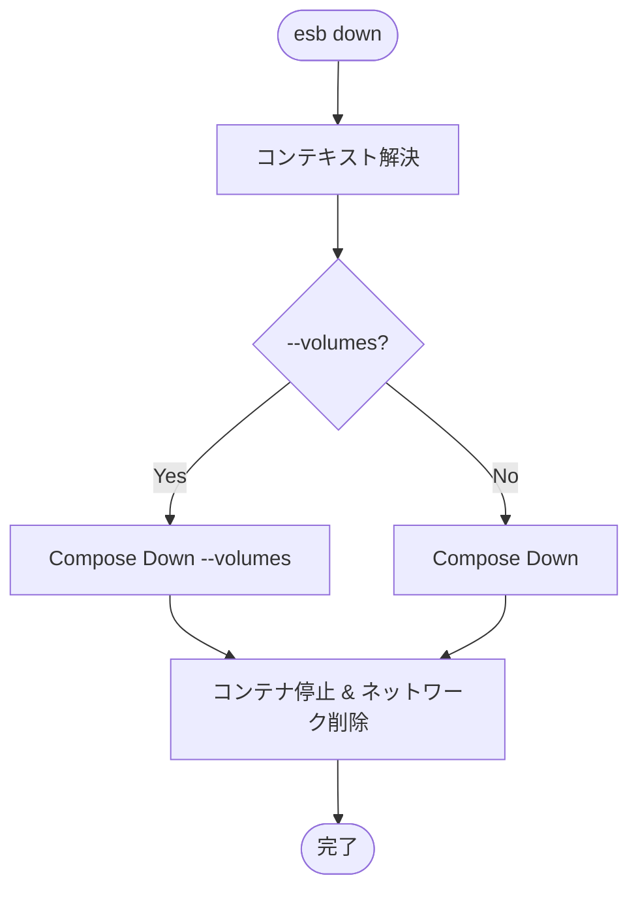

# `esb down` コマンド

## 概要

`esb down` コマンドは、現在の環境に関連付けられたコンテナを停止および削除します。これは `esb up` の逆の操作です。

## 使用方法

```bash
esb down [flags]
```

### フラグ

| フラグ | 短縮形 | 説明 |
|--------|--------|------|
| `--env` | `-e` | ターゲット環境 (例: local)。デフォルトは最後に使用された環境です。 |
| `--volumes` | `-v` | 名前付きボリューム (例: データベースのデータ) を削除します。 |
| `--force` | | 無効な `ESB_PROJECT`/`ESB_ENV` 環境変数を自動的に解除します。 |

## 実装詳細

コマンドのロジックは `cli/internal/app/down.go` に実装されています。

### ロジックフロー

1. **コンテキスト解決**: アクティブな環境に基づいてDocker Composeのプロジェクト名を特定します。
2. **コマンド実行**: `Downer.Down` メソッドを呼び出します。
3. **Dockerアクション**: `docker compose down` を実行します。`--volumes` が渡された場合、`-v` フラグを追加して関連ボリュームを削除します。

## フローチャート


