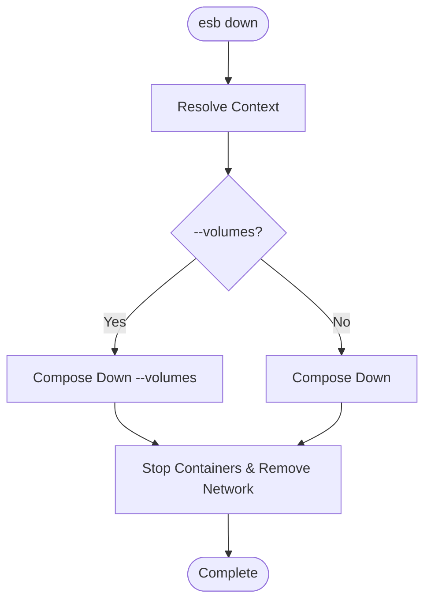

# `esb down` Command

## Overview

The `esb down` command stops and removes the containers associated with the current environment. It is the inverse of `esb up`.

## Usage

```bash
esb down [flags]
```

### Flags

| Flag | Short | Description |
|------|-------|-------------|
| `--env`, `-e` | | Target environment (e.g., local). Defaults to last used. |
| `--volumes`, `-v` | | Remove named volumes (e.g., database data). |
| `--force` | | Auto-unset invalid `ESB_PROJECT`/`ESB_ENV` variables. |

## Implementation Details

The command logic is implemented in `cli/internal/app/down.go`.

### Logic Flow

1. **Context Resolution**: Identifies the Docker Compose project name based on the active environment.
2. **Command Execution**: Invokes the `Downer.Down` method.
3. **Docker Action**: Executes `docker compose down`. If `--volumes` is passed, it appends the `-v` flag to remove associated volumes.

## Mermaid Flowchart


