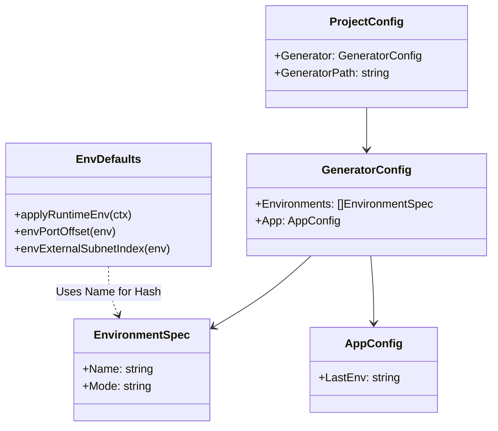
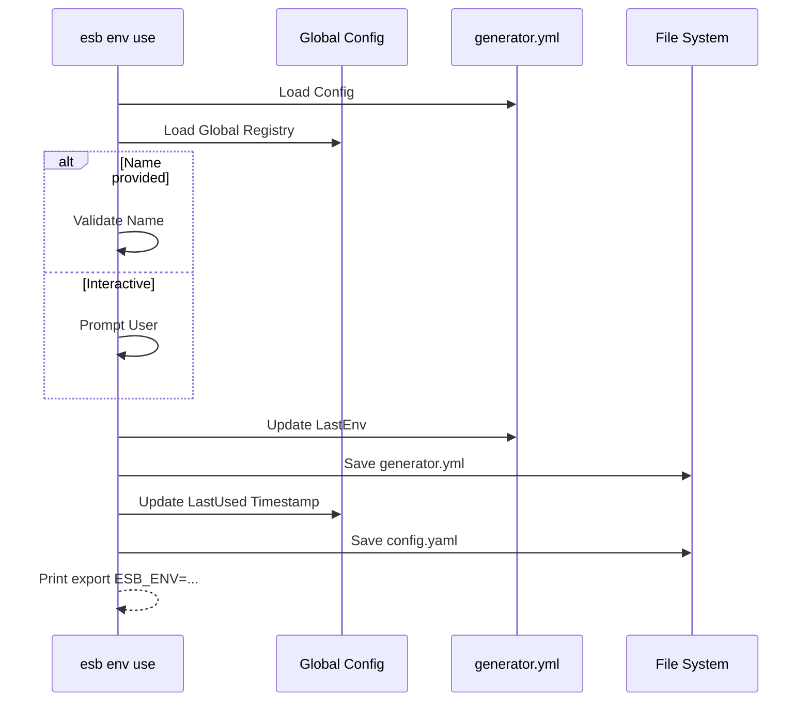

# `esb env` Command

## Overview

The `esb env` command family manages the environment configurations for the project. It allows users to list, create, switch, and remove environments (e.g., `local`, `dev`, `test`). It also manages the runtime environment variables used by the CLI and Docker containers.

## Usage

```bash
esb env [command] [flags]
```

### Subcommands

| Command | Description |
|---------|-------------|
| `list` | List all environments defined in `generator.yml`. |
| `add` | Add a new environment. |
| `use` | Switch the active environment. |
| `remove` | Remove an environment configuration. |
| `var` | Inspect environment variables of a running container. |

## Implementation Details

The logic is distributed across `cli/internal/app/env.go`, `cli/internal/app/env_defaults.go`, and `cli/internal/app/env_var.go`.

### Key Components

- **`generator.yml`**: The source of truth for environment definitions.
- **`Global Config`**: Stores the last used environment for the project.
- **Runtime Environment**: `applyRuntimeEnv` calculates and sets env vars (ports, subnets) deterministically based on the environment name to avoid collisions.

### Environment Management Flow

1. **List**: Reads `generator.yml`, detects running state via `StateDetector`, and prints a status table.
2. **Add**: Appends a new entry to `generator.yml`. Prompts for name and mode (docker, containerd, firecracker) if interactive.
3. **Use**: Updates `LastEnv` in `generator.yml` and the global project registry.
4. **Remove**: Deletes the entry from `generator.yml`. Prevents removing the last environment.

### Runtime Variable Injection

When any command runs (e.g., `up`, `build`), `applyRuntimeEnv` injects variables like:
- `ESB_ENV`: Current environment name.
- `ESB_PORT_*`: Port mappings (offset based on env name hash).
- `ESB_SUBNET_*`: Subnet CIDRs (offset based on env name hash).

## Class Diagram (Environment Data)



## Sequence Diagram (Switch Environment)


