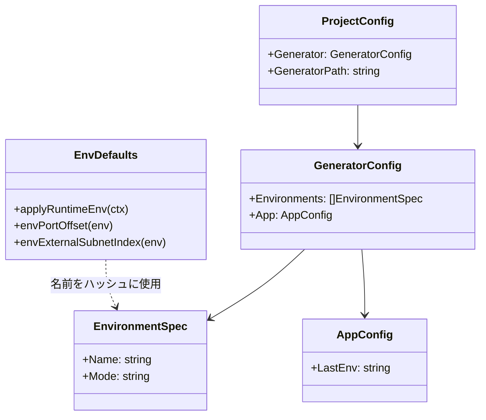
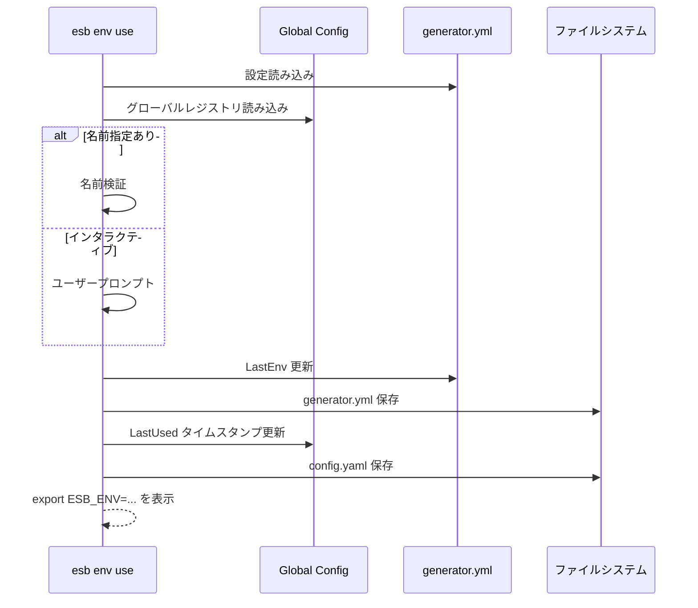

# `esb env` コマンド

## 概要

`esb env` コマンドファミリは、プロジェクトの環境設定を管理します。環境のリスト表示、作成、切り替え、削除（例: `local`, `dev`, `test`）が可能です。また、CLIおよびDockerコンテナで使用されるランタイム環境変数も管理します。

## 使用方法

```bash
esb env [command] [flags]
```

### サブコマンド

| コマンド | 説明 |
|----------|------|
| `list` | `generator.yml` で定義されているすべての環境をリスト表示します。 |
| `add` | 新しい環境を追加します。 |
| `use` | アクティブな環境を切り替えます。 |
| `remove` | 環境設定を削除します。 |
| `var` | 稼働中のコンテナの環境変数を検査します。 |

## 実装詳細

ロジックは `cli/internal/app/env.go`, `cli/internal/app/env_defaults.go`, `cli/internal/app/env_var.go` に分散されています。

### 主要コンポーネント

- **`generator.yml`**: 環境定義の信頼できる情報源（SSOT）。
- **`Global Config`**: プロジェクトで最後に使用された環境を保存します。
- **ランタイム環境**: `applyRuntimeEnv` は、衝突を避けるために環境名に基づいて環境変数（ポート、サブネット）を決定論的に計算し設定します。

### 環境管理フロー

1. **List**: `generator.yml` を読み込み、`StateDetector` を介して稼働状態を検出し、ステータステーブルを表示します。
2. **Add**: 新しいエントリを `generator.yml` に追加します。インタラクティブモードの場合、名前とモード（docker, containerd, firecracker）の入力を求めます。
3. **Use**: `generator.yml` の `LastEnv` とグローバルプロジェクトレジストリを更新します。
4. **Remove**: エントリを `generator.yml` から削除します。最後の環境の削除は防止されます。

### ランタイム変数注入

コマンド（例: `up`, `build`）が実行される際、`applyRuntimeEnv` は以下のような変数を注入します：
- `ESB_ENV`: 現在の環境名。
- `ESB_PORT_*`: ポートマッピング（環境名ハッシュに基づくオフセット）。
  - `ESB_PORT_GATEWAY_HTTPS` (Default: 443)
  - `ESB_PORT_S3` (Default: 9000)
  - `ESB_PORT_DATABASE` (Default: 8001)
- `ESB_SUBNET_*`: サブネットCIDR（環境名ハッシュに基づくオフセット）。

## クラス図 (環境データ)



## シーケンス図 (環境切り替え)


