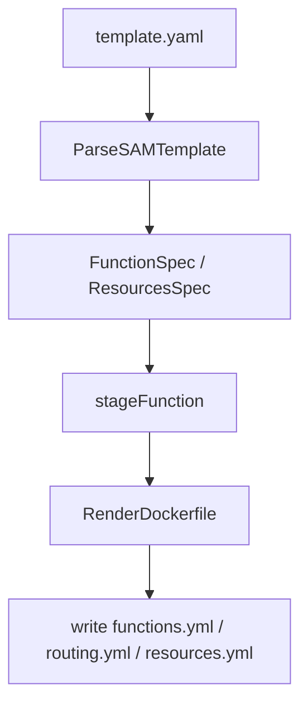

<!--
Where: cli/docs/generator-architecture.md
What: Template generator architecture for deploy artifacts.
Why: Explain parse/stage/render boundaries and safe extension paths.
-->
# Generator アーキテクチャ

## 概要
`cli/internal/infra/templategen` は、SAM テンプレートから deploy 用アーティファクトを生成します。

- `functions.yml`
- `routing.yml`
- `resources.yml`
- 各関数の build context / Dockerfile

## 役割分担
- 入口: `cli/internal/infra/templategen/generate.go`
- SAM 解析: `cli/internal/infra/sam/template_parser.go`
- 関数 staging: `cli/internal/infra/templategen/stage.go`
- layer staging: `cli/internal/infra/templategen/stage_layers.go`
- Java runtime 補助: `cli/internal/infra/templategen/stage_java_runtime.go`
- manifest 出力: `cli/internal/infra/templategen/bundle_manifest.go`

## パイプライン



## 生成上のルール
- `ImageSource` を持つ関数も Dockerfile を生成し、`FROM <ImageUri>` で hooks 注入イメージを再ビルドする
- 関数名は `template.ApplyImageNames` で正規化
- warnings は `stderr` 系出力へ集約
- 出力先は `<output>/<env>` 配下で完結

## 拡張プレイブック

### 1. 新しい関数属性を扱う
1. `cli/internal/infra/sam/template_functions_*.go` で抽出
2. `cli/internal/domain/template/types.go` に必要な型を追加
3. `generate.go` / renderer に反映
4. テスト:
   - `cli/internal/infra/sam/template_functions_test.go`
   - `cli/internal/infra/templategen/generate_test.go`

### 2. 新しい生成ファイルを追加
1. `generate.go` に書き出しを追加
2. `tools/artifactctl/pkg/engine/merge.go` と `usecase/deploy/runtime_config.go` への反映要否を確認
3. テスト:
   - `cli/internal/infra/templategen/generate_test.go`
   - `cli/internal/usecase/deploy/runtime_config_test.go`

### 3. Java runtime hooks staging を変更
1. `stage_java_runtime.go` を更新
2. `runtime-hooks/java/{wrapper,agent}` の JAR 必須コピー契約を維持
3. テスト:
   - `cli/internal/infra/templategen/generate_test.go`

## 変更時の最小テスト

```bash
cd cli && go test ./internal/infra/sam ./internal/infra/templategen -count=1
```
