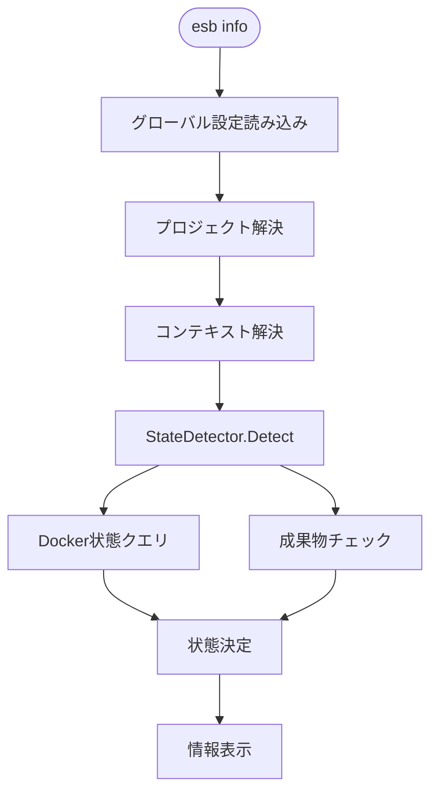

# `esb info` コマンド (デフォルト)

## 概要

`esb info` コマンドは、CLIバージョン、設定パス、アクティブなプロジェクトの詳細、および環境のランタイム状態を含む、現在のシステム状態のサマリーを表示します。

**注意**: 引数なしで `esb` を実行した場合、このコマンドが暗黙的に実行されます。

## 使用方法

```bash
esb
# または
esb info
```

## 実装詳細

コマンドのロジックは `cli/internal/app/info.go` に実装されています。`DetectorFactory` から `StateDetector` を生成し、Docker/ファイルシステムを照会して状態を判定します。

### 表示情報

1. **Version**: CLIのバージョン。
2. **Config**: グローバル設定のパス。
3. **Project**:
   - 名前とルートディレクトリ。
   - ジェネレーター設定パス (`generator.yml`)。
   - SAMテンプレートパス。
   - 出力ディレクトリ。
4. **Environment**:
   - アクティブな環境名とモード (例: `local (docker)`)。
   - **State**: `StateDetector` を介して導出された状態 (例: `running`, `stopped`, `built`)。
   - Composeプロジェクト名 (`esb-local`)。

### ロジックフロー

1. **グローバル設定読み込み**: `~/.config/esb/config.yaml` を検証します。
2. **プロジェクト解決**: アクティブなプロジェクトを特定します。
3. **状態検出**:
   - `DetectorFactory` から `StateDetector` を構築し、Dockerおよびファイルシステムをクエリします。
   - コンテキストが不足している場合は「未初期化」、設定済みの場合はリアルタイムのステータスを報告します。

## フローチャート


