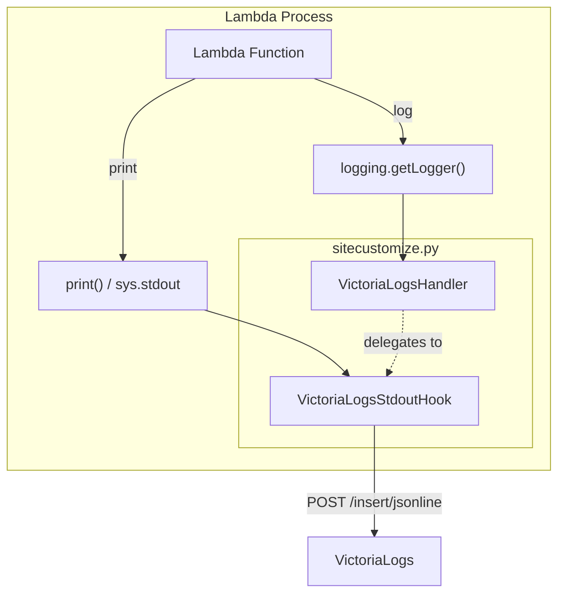

<!--
Where: cli/docs/local-logging-adapter.md
What: Direct logging adapter design via sitecustomize.py.
Why: Document log forwarding behavior for Lambda runtime images.
-->
# 透過的ロギングアダプター設計 (Direct Logging)

## 概要

本基盤では、Lambda関数からの標準出力（stdout/stderr）およびログ（loggingモジュール）を、**アプリケーションコードの変更なしに** VictoriaLogs へ直接送信する仕組みを提供しています。

以前は Fluentd (Docker Logging Driver) を使用していましたが、短命なコンテナにおけるログ欠損問題（Log Loss）を解決するため、プロセス内から直接 HTTP API を叩く **Direct Logging** 方式に移行しました。

## アーキテクチャ

**`sitecustomize.py`** が Python プロセス起動時に自動ロードされ、以下のフックを適用します。

## 実装詳細

### 1. `sitecustomize.py`
Dockerイメージのビルド時に `esb-lambda-base` に配置されます。コンテナ起動時に自動的に実行され、環境変数 `VICTORIALOGS_URL` が存在する場合のみ有効化されます。

- **Stdout Hook**: `sys.stdout` と `sys.stderr` をラップし、書き込みが発生するたびに非同期（または擬似的な同期）で VictoriaLogs へ送信します。
- **Windows環境対策**: Windows上のDockerでは、短命なコンテナが終了する際、バッファに残ったログが出力されずにプロセスが死ぬことがあります。これを防ぐため、Lambda関数の実行終了時（`finally` ブロック）に明示的に `sys.stdout.flush()` を呼び出しています。
- **Logging Handler**: 標準の `logging` モジュールのルートロガーに JSON フォーマッタを設定し、構造化ログを出力します。

### 2. 環境変数

| 変数名 | 説明 | デフォルト |
|--------|------|------------|
| `VICTORIALOGS_URL` | ログ送信先エンドポイント | `http://victorialogs:9428` |
| `LOG_LEVEL` | ログ出力レベル | `INFO` |
| `AWS_LAMBDA_FUNCTION_NAME` | ログの `container_name` タグとして使用 | コンテナ名 |

> [!NOTE]
> `VICTORIALOGS_URL` は **ベース URL** を指定します。`sitecustomize.py` が内部で `/insert/jsonline` を付与します。

## VictoriaLogs UI

- URL: `http://localhost:9428/select/vmui`
- 検索クエリ例:
  - 全ログ: `_stream_id: "stdout"`
  - 特定のLambda: `container_name: "lambda-hello"`
  - エラーのみ: `level: "ERROR"`
  - Trace ID検索: `trace_id: "xxx"`

## メリット

1. **ログ欠損なし**: プロセス終了直前のログ書き込みもフラッシュされるため、コンテナが即座に削除されてもログが残ります。
2. **構造化ログ**: テキストの `print()` 出力も、可能な限り JSON としてパースし、タグ付けして保存されます。
3. **Trace ID 連携**: コンテキストから Trace ID を自動的に抽出し、ログレコードに付与します。

---

## Implementation references
- `cli/internal/infra/build/assets/python/site-packages/sitecustomize.py`
