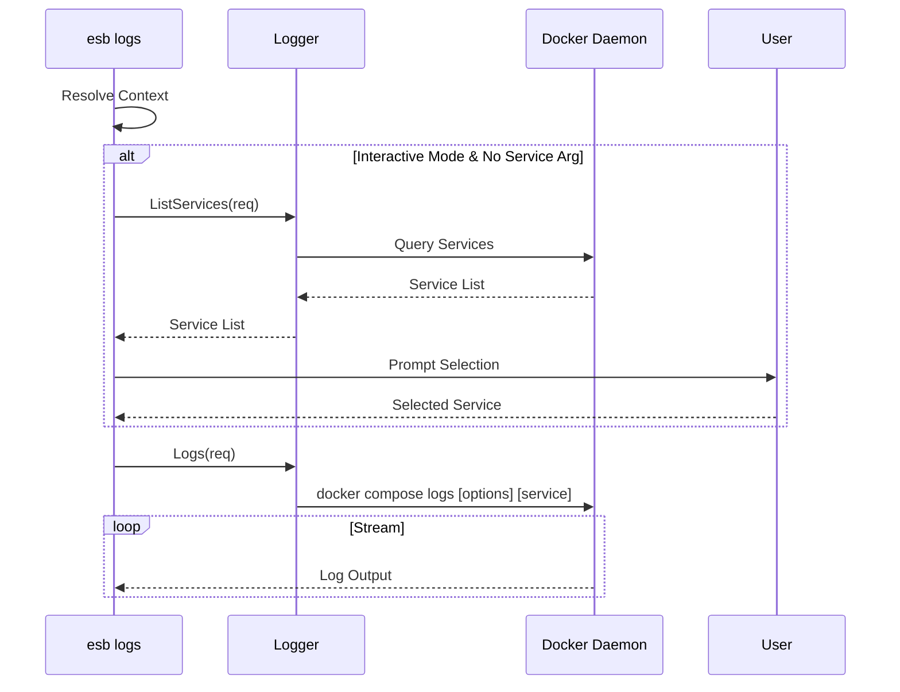

# `esb logs` Command

## Overview

The `esb logs` command retrieves log output from services running in the active environment. It supports log tailing, following (streaming), and filtering by specific service.

## Usage

```bash
esb logs [service] [flags]
```

### Arguments

| Argument | Description |
|----------|-------------|
| `service` | (Optional) Name of the service to view logs for (e.g., `gateway`, `agent`). If omitted in interactive mode, a selection menu is shown. |

### Flags

| Flag | Short | Description |
|------|-------|-------------|
| `--env`, `-e` | | Target environment (e.g., local). Defaults to last used. |
| `--follow`, `-f` | | Stream new log output. |
| `--tail` | | Number of lines to show from the end of the logs. |
| `--timestamps` | | Show timestamps in log output. |
| `--force` | | Auto-unset invalid `ESB_PROJECT`/`ESB_ENV` variables. |

## Implementation Details

The command logic is implemented in `cli/internal/app/logs.go`.

### Key Components

- **`LogsRequest`**: Struct carrying configuration (Follow, Tail, Service, etc.).
- **`Logger`**: Interface for retrieving logs.
- **Interactive Selection**: If no service is specified and the shell is interactive, `ListServices` is called, and a prompt allows the user to select a service or "All".

### Logic Flow

1. **Context Resolution**: Determines the active environment.
2. **Interactive Selection (Optional)**:
   - If `service` arg is empty AND `isTerminal` is true:
     - Query `Logger.ListServices`.
     - Present list via `Prompter`.
     - Update `req.Service` with selection.
3. **Log Retrieval**: Calls `Logger.Logs(req)`, which typically wraps `docker compose logs`.

## Mermaid Sequence Diagram


