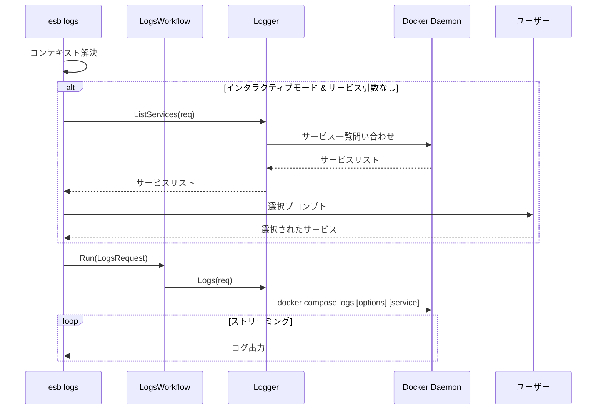

# `esb logs` コマンド

## 概要

`esb logs` コマンドは、アクティブな環境で稼働しているサービスのログ出力を取得します。ログの末尾表示、フォロー（ストリーミング）、および特定のサービスによるフィルタリングをサポートしています。

## 使用方法

```bash
esb logs [service] [flags]
```

### 引数

| 引数 | 説明 |
|------|------|
| `service` | (オプション) ログを表示するサービス名 (例: `gateway`, `agent`)。インタラクティブモードで省略された場合、選択メニューが表示されます。 |

### フラグ

| フラグ | 短縮形 | 説明 |
|--------|--------|------|
| `--env` | `-e` | ターゲット環境 (例: local)。デフォルトは最後に使用された環境です。 |
| `--follow` | `-f` | 新しいログ出力をストリーミングします。 |
| `--tail` | | ログの末尾から指定された行数を表示します。 |
| `--timestamps` | | ログ出力にタイムスタンプを表示します。 |
| `--force` | | 無効な `ESB_PROJECT`/`ESB_ENV` 環境変数を自動的に解除します。 |

## 実装詳細

CLIアダプタは `cli/internal/commands/logs.go`、オーケストレーションは `cli/internal/workflows/logs.go` が担当します。

### 主要コンポーネント

- **`LogsRequest`**: 設定 (Follow, Tail, Service等) を保持する構造体。
- **`Logger`**: ログ取得のためのインターフェース。
- **インタラクティブ選択**: サービスが指定されておらず、シェルがインタラクティブな場合、`ListServices` が呼び出され、ユーザーにサービス（または "All"）を選択させるプロンプトが表示されます。

### ロジックフロー

1. **コンテキスト解決**: アクティブな環境を決定します。
2. **インタラクティブ選択 (オプション)**:
   - `service` 引数が空かつ `isTerminal` が true の場合:
     - `Logger.ListServices` をクエリします。
     - `Prompter` を介してリストを表示します。
     - 選択結果で `req.Service` を更新します。
3. **ログ取得**: `LogsWorkflow` が `Logger.Logs(req)` を呼び出します。これは通常 `docker compose logs` をラップします。

## シーケンス図


