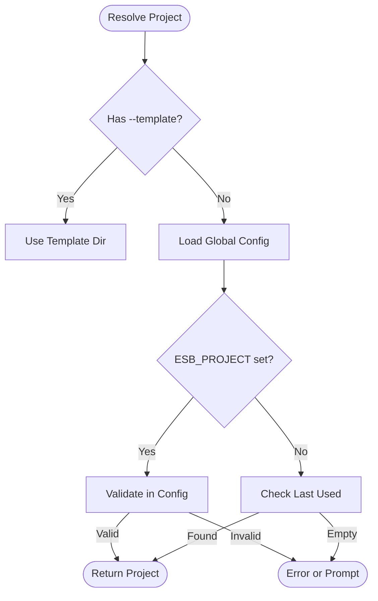

# `esb project` Command

## Overview

The `esb project` command family is used to register, navigate, and manage different ESB projects. It maintains a global registry of projects (in `~/.config/esb/config.yaml`), allowing users to switch contexts easily without navigating the file system.

## Usage

```bash
esb project [command] [flags]
```

### Subcommands

| Command | Description |
|---------|-------------|
| `list`, `ls` | List all registered projects. |
| `recent` | List projects sorted by recent usage (numbered). |
| `add` | Register a new project (or initialize one from a SAM template). |
| `use` | Switch the active project. |
| `remove` | Deregister a project from the global config. |

## Implementation Details

The logic is distributed across `cli/internal/app/project.go`, `cli/internal/app/project_register.go`, and `cli/internal/app/project_resolver.go`.

### Key Components

- **Global Registry**: Stores project metadata (Name, Path, LastUsed).
- **Project Resolver**: Logic to determine the active project based on:
  1. CLI Flag (`--template`)
  2. Environment Variable (`ESB_PROJECT`)
  3. Interactive Selection (if not set)
- **Project Init**: `runProjectAdd` detects `generator.yml` or initializes it from a SAM template if missing.

### Logic Flow

#### Project Resolution (`ResolveProjectSelection`)
1. **Explicit Template**: If `--template` is passed, the parent directory is used.
2. **Environment Variable**: Checks `ESB_PROJECT`. Verifies validity against global config.
3. **Interactive Mode**: If ambiguous, prompts the user or fails.

#### Project Use
1. **Selection**: User provides a name OR a 1-based index (referencing the `recent` list).
2. **Persistence**: Updates the global config file with the new `LastUsed` timestamp.
3. **Output**: Prints `export ESB_PROJECT=...` for shell integration.

## Mermaid Flowchart (Project Resolution)


