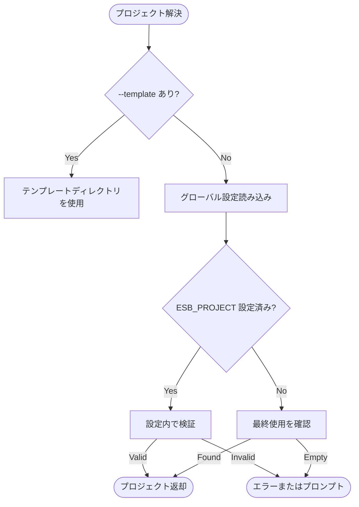

# `esb project` コマンド

## 概要

`esb project` コマンドファミリは、異なるESBプロジェクトの登録、移動、および管理に使用されます。プロジェクトのグローバルレジストリ（`~/.config/esb/config.yaml`）を維持し、ファイルシステムを移動することなくコンテキストを簡単に切り替えることができます。

## 使用方法

```bash
esb project [command] [flags]
```

### サブコマンド

| コマンド | 説明 |
|----------|------|
| `list`, `ls` | 登録されているすべてのプロジェクトをリスト表示します。 |
| `recent` | 最近の使用順にプロジェクトをリスト表示します（番号付き）。 |
| `add` | 新しいプロジェクトを登録します（またはSAMテンプレートから初期化します）。 |
| `use` | アクティブなプロジェクトを切り替えます。 |
| `remove` | グローバル設定からプロジェクトの登録を解除します。 |

## 実装詳細

CLIアダプタは `cli/internal/app/project.go` にあり、プロンプトや初期化処理を担当します。プロジェクト一覧/切り替え/削除/登録のオーケストレーションは `cli/internal/workflows/project.go` に移行されています。プロジェクト選択の解決は `cli/internal/app/project_resolver.go` が担います。

### 主要コンポーネント

- **グローバルレジストリ**: プロジェクトのメタデータ（名前、パス、最終使用日時）を保存します。
- **プロジェクトリゾルバ**: 以下に基づいてアクティブなプロジェクトを決定するロジック：
  1. CLIフラグ (`--template`)
  2. 環境変数 (`ESB_PROJECT`)
  3. インタラクティブ選択（未設定の場合）
- **プロジェクト初期化**: `runProjectAdd` は `generator.yml` を検出するか、見つからない場合はSAMテンプレートから初期化します。初期化後の登録は `ProjectRegisterWorkflow` が行います。

### ロジックフロー

#### プロジェクト解決 (`ResolveProjectSelection`)
1. **明示的テンプレート**: `--template` が渡された場合、その親ディレクトリが使用されます。
2. **環境変数**: `ESB_PROJECT` をチェックします。グローバル設定に対して有効性を検証します。
3. **インタラクティブモード**: 曖昧な場合、ユーザーにプロンプトを表示するか、失敗します。

#### プロジェクト使用 (`Use`)
1. **選択**: ユーザーは名前、または1始まりのインデックス（`recent` リストを参照）を提供します。
2. **永続化**: グローバル設定ファイルを新しい `LastUsed` タイムスタンプで更新します。
3. **出力**: シェル統合用に `export ESB_PROJECT=...` を表示します。

## フローチャート (プロジェクト解決)


