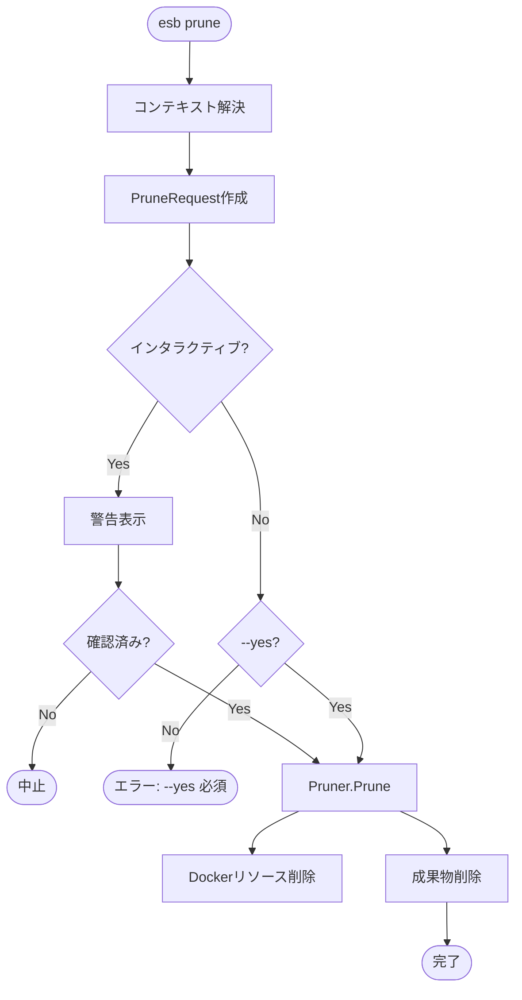

# `esb prune` コマンド

## 概要

`esb prune` コマンドは、ESB環境に関連付けられたDockerリソース（コンテナ、ネットワーク、イメージ）をクリーンアップし、生成されたビルド成果物を削除します。`docker system prune` に似ていますが、現在のプロジェクトと環境にスコープが限定されています。

## 使用方法

```bash
esb prune [flags]
```

### フラグ

| フラグ | 短縮形 | 説明 |
|--------|--------|------|
| `--env` | `-e` | ターゲット環境 (例: local)。デフォルトは最後に使用された環境です。 |
| `--yes` | `-y` | 確認プロンプトをスキップします。 |
| `--all` | `-a` | 未使用のすべてのESBイメージを削除します（danglingイメージだけでなく）。 |
| `--volumes` | | 未使用のボリュームを削除します。 |
| `--hard` | | `generator.yml` も削除します（完全初期化）。 |
| `--force` | | 無効な `ESB_PROJECT`/`ESB_ENV` 環境変数を自動的に解除します。 |

## 実装詳細

コマンドのロジックは `cli/internal/app/prune.go` に実装されています。

### 主要コンポーネント

- **`Pruner`**: リソース削除のためのインターフェース。
- **安全性チェック**: `--yes` が指定されていない限り、インタラクティブな確認が必要です。

### ロジックフロー

1. **コンテキスト解決**: プロジェクトスコープを決定します。
2. **警告表示**: フラグに基づいて削除される対象をリストアップします。
3. **確認**: ユーザーに確認を求めます（`--yes` がない場合）。
4. **実行 (`Pruner.Prune`)**:
   - コンテナを停止します（稼働中の場合）。
   - プロジェクト/環境ラベルが付与されたDockerリソース（コンテナ、ネットワーク、イメージ、ボリューム）を削除します。
   - `output/<env>/` ディレクトリを削除します。
   - `--hard` が設定されている場合、`generator.yml` を削除します。

## Mermaid フローチャート


