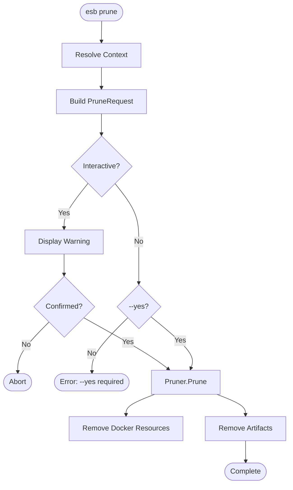

# `esb prune` Command

## Overview

The `esb prune` command cleans up Docker resources (containers, networks, images) associated with the ESB environment and removes generated build artifacts. It mimics `docker system prune` but is scoped to the current project and environment.

## Usage

```bash
esb prune [flags]
```

### Flags

| Flag | Short | Description |
|------|-------|-------------|
| `--env`, `-e` | | Target environment (e.g., local). Defaults to last used. |
| `--yes`, `-y` | | Skip confirmation prompt. |
| `--all`, `-a` | | Remove all unused ESB images, not just dangling ones. |
| `--volumes` | | Remove unused volumes. |
| `--hard` | | Also remove `generator.yml` (nuclear option). |
| `--force` | | Auto-unset invalid `ESB_PROJECT`/`ESB_ENV` variables. |

## Implementation Details

The command logic is implemented in `cli/internal/app/prune.go`.

### Key Components

- **`Pruner`**: Interface for resource removal.
- **Safety Checks**: Requires interactive confirmation unless `--yes` is specified.

### Logic Flow

1. **Context Resolution**: Determines the project scope.
2. **Warning Display**: Lists exactly what will be removed based on flags.
3. **Confirmation**: Prompts user (unless `--yes`).
4. **Execution (`Pruner.Prune`)**:
   - Stops containers (if running).
   - Removes Docker resources (containers, networks, images, volumes) labeled with the project/env.
   - Deletes the `output/<env>/` directory.
   - If `--hard` is set, deletes `generator.yml`.

## Mermaid Flowchart


