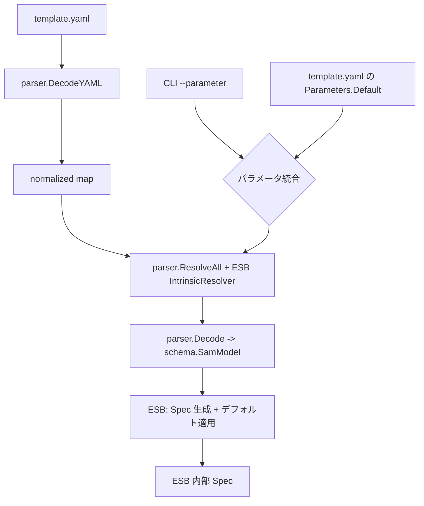

# SAM パース・アーキテクチャ

このドキュメントは、ESB における SAM テンプレートのパース処理を「利用側の視点」で説明します。`aws-sam-parser-go` は外部ライブラリとして扱い、内部実装の詳細には踏み込みません。

## 目的
- SAM テンプレートを ESB 内部の Spec へ変換するための全体像を示す
- ESB と外部ライブラリの責務境界を明確にする

## 責務分離

### ESB（利用側）
- 入力テンプレートの受け取りとエラーハンドリング
- パラメータの優先順位ルールの適用
- Intrinsic 解決ポリシー（ESB 仕様）の実装
- 生成された SAM 型から ESB Spec への変換
- ESB 固有のデフォルト値や命名規約の適用

### aws-sam-parser-go（外部ライブラリ）
- YAML の読み取りと Intrinsic タグの正規化
- Resolver インタフェースと再帰的ウォーカー
- SAM スキーマ型（`schema` パッケージ）の提供
- スキーマ生成ツール（ライブラリ側で管理）

## パース・パイプライン

## パラメータの優先順位
ESB はテンプレート内の `Parameters.Default` と CLI 引数の値を統合します。
- 優先順位は **CLI > テンプレート** です。

## Intrinsic 解決（ESB 仕様）
Intrinsic の解決は ESB 側の実装に閉じた仕様です。`aws-sam-parser-go` は「解決の仕組み」だけを提供し、具体的な解決ルールは ESB が決めます。

実装場所: `cli/internal/generator/intrinsics_resolver.go`

## ESB が扱うリソースの拡張
ESB が特定のリソースを Spec 化する場合は、ESB 側に明示的な処理を追加します。

- 実装場所: `cli/internal/generator/parser_resources.go`
- `schema` の型は `aws-sam-parser-go` から提供されるため、ESB は依存モジュールを更新するだけで利用できます

## テスト観点
- ESB 側: テンプレート入力→Spec 変換の統合テストを重視
- ライブラリ側: YAML デコード、Resolver、スキーマ生成の単体テストを担当
