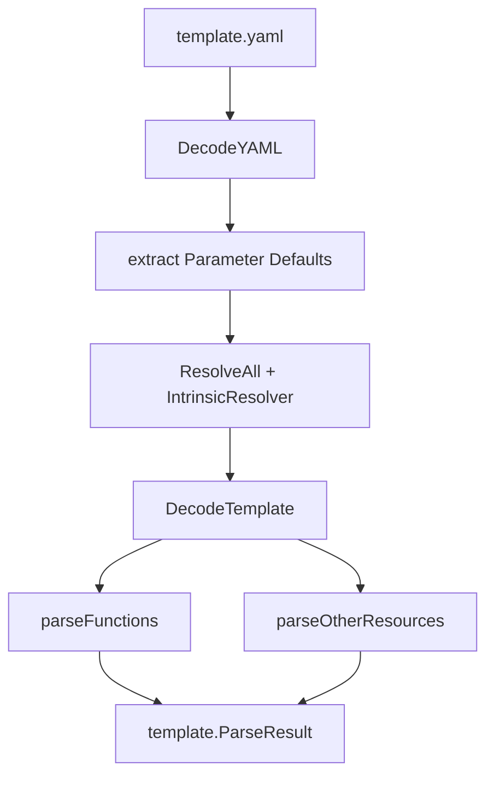

<!--
Where: cli/docs/sam-parsing-architecture.md
What: SAM parsing behavior and extension contracts for CLI.
Why: Prevent parsing regressions and clarify where to add new SAM support.
-->
# SAM パース・アーキテクチャ

## 概要
CLI は `aws-sam-parser-go` を利用しつつ、`cli/internal/infra/sam` で内部仕様を定義します。

- YAML decode / walker は外部ライブラリ
- intrinsic 解決ポリシー、関数/リソース変換は CLI 側

## パースフロー



実装:
- 入口: `cli/internal/infra/sam/template_parser.go`
- intrinsic: `cli/internal/infra/sam/intrinsics_*.go`
- 関数: `cli/internal/infra/sam/template_functions_*.go`
- リソース: `cli/internal/infra/sam/template_resources.go`

## パラメータ優先順位
1. `Parameters.Default`（テンプレート内）
2. deploy 入力値（CLI で上書き）

## 関数サポート
- `AWS::Serverless::Function`
  - Zip 関数
  - Image 関数（`PackageType: Image` / `ImageUri`）
- `AWS::Lambda::Function`
  - Image 関数（`Code.ImageUri`）
  - Zip は対象外

`ImageUri` に未解決変数が残る場合は fail-fast でエラー。

## リソースサポート
- `AWS::DynamoDB::Table`
- `AWS::S3::Bucket`
- `AWS::Serverless::LayerVersion`

## 警告/エラー方針
- decode 不能や契約違反は error
- 型マッピングの一部失敗は warning collector に集約
- warning は generator 経由で出力される

## 拡張プレイブック

### 1. 新しい SAM リソース型を追加
1. `template_resources.go` に抽出ロジック追加
2. `domain/manifest` 型を必要に応じて拡張
3. renderer/templategen 反映
4. テスト: `template_parser_test.go`, `template_functions_test.go`

### 2. 新しい Intrinsic を追加
1. `intrinsics_resolve_dispatch.go` にディスパッチ追加
2. 必要なら `intrinsics_conditions.go` / helper 更新
3. テスト: `intrinsics_test.go`, `intrinsics_helpers_test.go`

### 3. 関数プロパティの対応を追加
1. `template_functions_serverless.go` か `template_functions_lambda.go` に追加
2. `template.FunctionSpec` へ反映
3. テスト: `template_functions_test.go`

## 変更時の最小テスト

```bash
cd cli && go test ./internal/infra/sam -count=1
```
