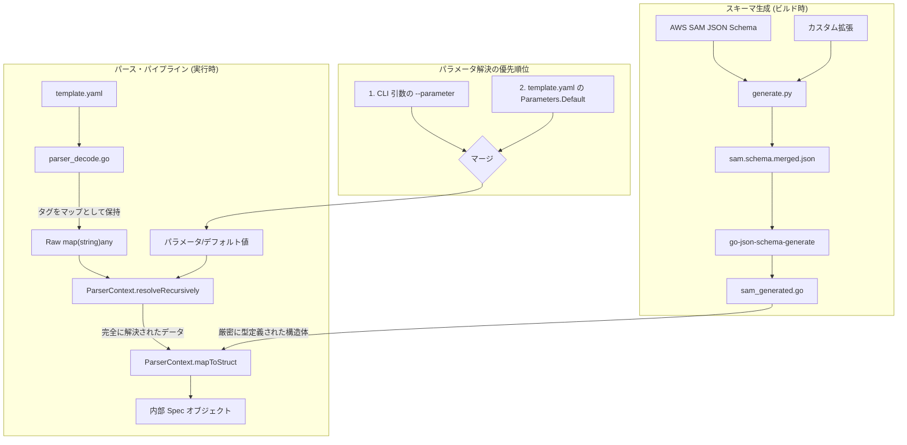

# SAM パース & スキーマ・アーキテクチャ

このドキュメントでは、`edge-serverless-box` における AWS SAM (Serverless Application Model) テンプレートのパース処理と、スキーマ駆動型アプローチの技術的な詳細について説明します。

## 概要

AWS SAM テンプレートのパースには以下の課題があります：
1.  **厳密な型定義**: SAM は膨大かつ進化し続けるプロパティを持っています。
2.  **組み込み関数 (Intrinsic Functions)**: `!Ref`, `!Sub`, `!Join`, `!GetAtt` などが多用されます。
3.  **柔軟な定義**: コンテキストに応じて、フィールドがスカラー、リスト、マップのいずれかを取り得ます。

これらを解決するため、本プロジェクトでは**スキーマ駆動型パース・パイプライン**を採用しています。

## 構成図



## 1. スキーマ生成

型安全性の確保とメンテナンスの容易化のため、公式の AWS SAM JSON スキーマから Go の構造体を自動生成しています。

### 必要条件
スキーマ生成に関わる作業を行うには、以下のツールが必要です：
1.  **Python 3**: `generate.py` の実行に必要。
2.  **schema-generate**: Go コード生成ツール (`go install github.com/elastic/go-json-schema-generate@latest`)。

### ワークフロー
- **ソース**: `tools/schema-gen/sam.schema.json`。
- **マージ**: `generate.py` がベースの SAM スキーマと `tools/schema-gen/extensions/` 内のカスタム拡張をマージします。これにより、標準スキーマに不足している S3 や DynamoDB の詳細なプロパティを補完します。
- **生成**: `elastic/go-json-schema-generate` を使用して `cli/internal/generator/schema/sam_generated.go` を作成します。

### 新しいリソース/プロパティを追加する場合の手順

新しい AWS リソース (例: `AWS::SNS::Topic`) をサポートする必要がある場合：

1.  **CloudFormation スペックの用意**: 対象リソースの CloudFormation リソース仕様を取得します。
2.  **拡張ファイルの追加**: `tools/schema-gen/extensions/` に新しい JSON ファイル (例: `aws-sns-topic.json`) を作成します。形式は CloudFormation リソース仕様に準拠してください。
3.  **生成スクリプトの実行**:
    ```bash
    cd tools/schema-gen
    python3 generate.py
    ```
    このスクリプトは以下の処理を行います：
    - ベースの `sam.schema.json` と `extensions/` 内の全ファイルをマージ。
    - プロパティ型の自動修飾 (サブタイプへのリソース名プレフィックス付与など)。
    - `schema-generate` を実行し `cli/internal/generator/schema/sam_generated.go` を更新。
4.  **パースコードの更新**:
    - `cli/internal/generator/parser_resources.go` の `parseOtherResources` に新しいケースを追加します。
    - 生成された新しい構造体 (例: `schema.AWSSNSTopic`) を使用し、`ctx.mapToStruct(resource, &target)` でマッピングを試みます。
5.  **テストによる検証**: `cli/internal/generator/parser_test.go` にテストケースを追加し、新しいリソースが正しくパースされることを確認します。

### トラブルシューティング: 型名の衝突
`schema-generate` は、複数のリソースが同じ名前のサブプロパティ（例: `Properties` や `Auth`）を持つ場合、型名に連番を振ったり衝突を起こしたりすることがあります。
- `generate.py` 内の `TITLES_TO_REMOVE` を使用して、競合の原因となる汎用的なタイトルを除去しています。
- 新しい拡張を追加して型名が不安定になった場合は、`generate.py` の `sanitize_title` ロジックを確認してください。

### ForceGeneration について
`sam.schema.json` は巨大なため、生成ツールが「使用されていない」と判断したリソースを自動的に削除（Tree-shaking）してしまうことがあります。これを防ぐため、`generate.py` は `ForceGeneration` というダミー定義を動的に作成し、`definitions` 内のすべての AWS リソースが明示的に参照されるように強制しています。

## 2. 組み込み関数 (Intrinsic Function) の解決

パースの中核となるのは `ParserContext` です。これは CloudFormation 形式の組み込み関数を具体的な値に変換する責務を持ちます。

### 再帰的解決 (Recursive Resolution)
SAM テンプレートでは関数がネストされることがよくあります：
`!Sub "http://${MyParam}-${AWS::Region}"`

解決は以下の 2 段階で行われます：
1.  **先行解決 (Pre-resolution)**: `resolveRecursively` が `map[string]any` ツリーをボトムアップでトラバースします。構造体へのマッピング**前**に全ての値を確定させることで、型変換エラーを未然に防ぎます。
2.  **深度制御**: 循環参照（`!Ref` が互いに参照し合うなど）による無限ループを防ぐため、深度制限 (デフォルト 20) が設けられています。制限を超えた場合は、それ以上の解決を停止し、生の値を返します。

### サポートされている関数
| 関数 | 論理 |
| :--- | :--- |
| `!Ref` | `Parameters` から値を検索。見つからない場合は論理 ID 文字列を返します。 |
| `!Sub` | パラメータや擬似パラメータ (`AWS::Region` など) を使用して変数を展開します。 |
| `!Join` | 解決された値のリストを指定した区切り文字で結合します。 |
| `!GetAtt` | 決定論的なプレースホルダー ARN (`arn:aws:local:[Attr]:global:[Res]/[Attr]`) を生成します。 |
| `!Split` / `!Select` | 文字列の分割と配列要素の選択を行います。 |
| `!If` | `Conditions` セクションで定義された条件に基づき、値を分岐させます。オンデマンドで評価され、結果はキャッシュされます。 |
| `Fn::Equals` / `And` / `Or` / `Not` | `Conditions` 内で論理評価を行います。 |
| `!ImportValue` | 他のスタックからのエクスポート値を（プレースホルダーとして）解決します。 |

### 条件評価の堅牢性
複雑なテンプレートにおける条件の依存関係に対応するため、以下の仕組みを備えています：
- **オンデマンド評価**: 条件が必要になった時点で初めて評価を行い、結果を `ConditionCache` に保存します（冪等性の確保）。
- **循環参照検出**: 条件が自分自身を間接的に参照している場合、無限ループを避けるために `ConditionStack` を用いてエラー（Warning）を報告します。

## 3. 厳密なマッピング (`mapToStruct`)

組み込み関数が解決された生のマップデータは、最終的に `mitchellh/mapstructure` を使用して Go の構造体にマッピングされます。

```go
func (ctx *ParserContext) mapToStruct(input any, output any) error {
	resolved := ctx.resolveRecursively(input, 0)

	config := &mapstructure.DecoderConfig{
		TagName:          "json", // 生成済み構造体の json タグを流用
		WeaklyTypedInput: true,   // 数値型への文字列代入などの型変換を許可
		Result:           output,
	}

	decoder, err := mapstructure.NewDecoder(config)
	if err != nil {
		return err
	}

	return decoder.Decode(resolved)
}
```

以前は JSON シリアライズを介した「JSON Bridge Pattern」を採用していましたが、現在は `mapstructure` への移行により、中間文字列の生成を排除し、パフォーマンスと型安全性のバランスを最適化しています。`json` タグを明示的に指定することで、自動生成された構造体との互換性を完全に維持しています。

## 4. デフォルト値の解決と命名規約

AWS SAM では、プロパティが省略された場合に特定の命名規則（例: S3 バケット名は論理 ID を小文字化したもの）に従うことがあります。これらのオピニオンを含んだデフォルト解決ロジックは `parser_defaults.go` に集約されています。

- **中央集約**: `DefaultLambdaRuntime` や `DefaultCodeURI` などの定数を定義。
- **解決ヘルパー**: `ResolveS3BucketName`, `ResolveTableName`, `ResolveCodeURI` などの関数を提供し、複数のリソースタイプ間で一貫した解決ロジックを強制します。

## 5. 開発時のベストプラクティス

- **手動での型キャストを避ける**: 常に `ctx.asString()`, `ctx.asInt()` などのメソッドを使用してください。これらは型変換と組み込み関数の解決を自動的に行います。
- **Resolve ヘルパーの活用**: リソース名や属性のデフォルト値を決定する際は、`parser_defaults.go` の `ResolveXXX` 関数を優先して使用してください。
- **生成された構造体を使用する**: リソースをパースする際は、`schema` パッケージの構造体を使用し `mapToStruct` を通してください。これにより、SAM 仕様の進化に伴うプロパティの追加を漏れなくキャッチできます。
- **エラー報告と修正の指針**:
    - `ParserContext.Warnings` を介して、ユーザーに非致命的なエラー（パース失敗の理由など）を通知できます。警告のデデュープ（重複排除）は自動的に行われます。
    - 「未知のフィールド」によるマッピング不全は、スキーマ拡張が必要なサインです。
