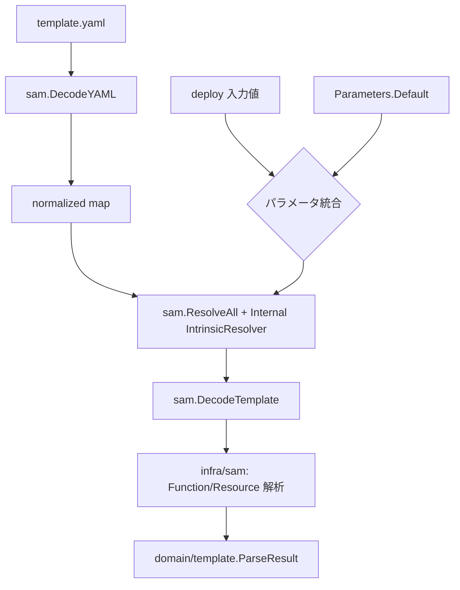

# SAM パース・アーキテクチャ

このドキュメントは、CLI における SAM テンプレートのパース処理を「利用側の視点」で説明します。
`aws-sam-parser-go` は外部ライブラリとして扱い、内部実装の詳細には踏み込みません。

## 目的
- SAM テンプレートを内部 Spec へ変換する流れを示す
- CLI 実装と外部ライブラリの責務境界を明確にする

## 責務分離

### CLI（利用側）
- 入力テンプレートの受け取りとエラーハンドリング
- パラメータの優先順位ルールの適用
- Intrinsic 解決ポリシー（内部仕様）の実装
- SAM 型から内部 Spec（`manifest`）への変換
- 内部デフォルト値・命名規約の適用

### aws-sam-parser-go（外部ライブラリ）
- YAML の読み取りと Intrinsic タグの正規化
- Resolver インタフェースと再帰的ウォーカー
- SAM スキーマ型（`schema` パッケージ）の提供

## パース・パイプライン

## パラメータの優先順位
- `Parameters.Default` を初期値として取り込み
- deploy 入力値が **上書き** されます

## Intrinsic 解決（内部仕様）
CLI は以下の Intrinsic を解決します:
- `Ref`
- `Fn::If`
- `Fn::Sub`
- `Fn::Join`
- `Fn::GetAtt`
- `Fn::Split`
- `Fn::Select`
- `Fn::ImportValue`
- `Condition` / `Fn::Equals` / `Fn::Not` / `Fn::And` / `Fn::Or`

実装場所: `cli/internal/infra/sam/intrinsics_resolver.go`

## デフォルト値の適用
`Globals.Function` を読み、以下をデフォルトとして適用します:
- Runtime / Handler / Timeout / MemorySize
- Environment.Variables
- Architectures
- Layers
- RuntimeManagementConfig

未指定時の既定値は以下です:
- Runtime: `python3.12`
- Handler: `lambda_function.lambda_handler`
- Timeout: `30`
- Memory: `128`

## リソース抽出
以下のリソースを内部の manifest に変換します:
- `AWS::DynamoDB::Table`
- `AWS::S3::Bucket`
- `AWS::Serverless::LayerVersion`

実装場所: `cli/internal/infra/sam/template_resources.go`

## 未対応・無視される項目
以下はパース対象外のため、deploy/build には反映されません:
- `AWS::IAM::Role` など、上記に含まれないリソース
- `AWS::Lambda::Function` の ZIP パッケージ（`PackageType: Zip`）
- `Function.Role`（`!GetAtt ...` で指定しても無視）
- `Globals.Function.Tags` / `Resources.*.Tags`
- `EphemeralStorage`
- `Description`
- `Outputs`

必要な場合は CLI 側に対応追加が必要です。

## Image 関数対応
- `AWS::Serverless::Function`
  - `PackageType: Image` または `ImageUri` を検知
  - `ImageUri` を `FunctionSpec.ImageSource` として保持
- `AWS::Lambda::Function`
  - `PackageType: Image` + `Code.ImageUri` を検知
  - `Code.ImageUri` を `FunctionSpec.ImageSource` として保持

`ImageSource` を持つ関数は ZIP 関数と別経路で処理され、`Dockerfile` 生成対象から除外されます。

また、`ImageUri` / `Code.ImageUri` に `${...}` が残っている場合は
「未解決パラメータ」として parse error にします。
（実行時失敗ではなく deploy 時に fail-fast するため）

## 出力
`ParseResult` として以下を返します:
- `Functions []FunctionSpec`（関数定義）
- `Resources manifest.ResourcesSpec`（DynamoDB / S3 / Layers）

## テスト観点
- Intrinsic resolver の単体テスト
- `ParseSAMTemplate` の統合テスト（イベント、デフォルト、リソース抽出）
- 生成結果は renderer のスナップショットで確認
