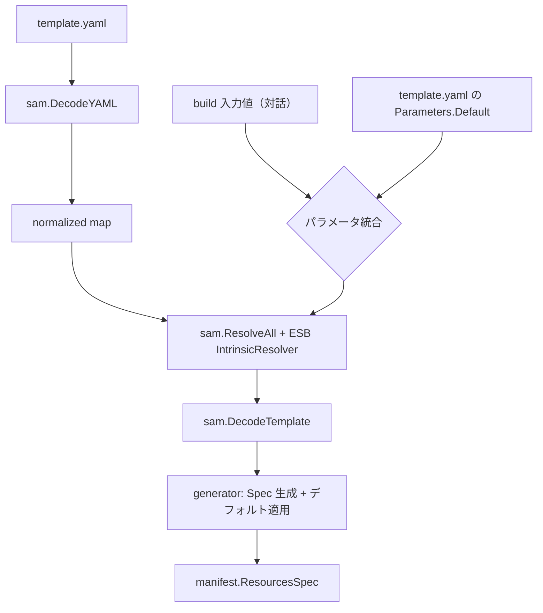

# SAM パース・アーキテクチャ

このドキュメントは、ESB における SAM テンプレートのパース処理を「利用側の視点」で説明します。`aws-sam-parser-go` は外部ライブラリとして扱い、内部実装の詳細には踏み込みません。

## 目的
- SAM テンプレートを ESB 内部の Spec へ変換するための全体像を示す
- ESB と外部ライブラリの責務境界を明確にする

## 責務分離

### ESB（利用側）
- 入力テンプレートの受け取りとエラーハンドリング
- パラメータの優先順位ルールの適用
- Intrinsic 解決ポリシー（ESB 仕様）の実装
- SAM 型から ESB 内部 Spec（`manifest`）への変換
- ESB 固有のデフォルト値や命名規約の適用

### aws-sam-parser-go（外部ライブラリ）
- YAML の読み取りと Intrinsic タグの正規化
- Resolver インタフェースと再帰的ウォーカー
- SAM スキーマ型（`schema` パッケージ）の提供
- スキーマ生成ツール（ライブラリ側で管理）

## パース・パイプライン

## パラメータの優先順位
ESB はテンプレート内の `Parameters.Default` と build 時の入力値を統合します。
- 優先順位は **build 入力 > テンプレート** です。

## Intrinsic 解決（ESB 仕様）
Intrinsic の解決は ESB 側の実装に閉じた仕様です。`aws-sam-parser-go` は「解決の仕組み」だけを提供し、具体的な解決ルールは ESB が決めます。

実装場所: `cli/internal/generator/intrinsics_resolver.go`

## ESB が扱うリソースの拡張
ESB が特定のリソースを Spec 化する場合は、ESB 側に明示的な処理を追加します。

- 実装場所: `cli/internal/generator/parser_resources.go`
- `manifest` の内部型へ変換して保持するため、`schema` 依存は `cli/internal/sam` に集約されます

## Generator / Manifest 境界

### 役割
- **generator**: SAMテンプレートを解析し、`FunctionSpec` と `manifest.ResourcesSpec` を生成。アセットのステージングと `functions.yml` / `routing.yml` / Dockerfile を出力。
- **manifest**: `provisioner` が適用するリソースの意図を保持する純粋な内部型。

### 依存方向
- `generator` -> `manifest`（内部型のみ）
- `provisioner` -> `manifest`
- `generator` -> `sam`（外部 parser/schema の境界）

### テスト観点
- renderer のスナップショットで出力差分を検知
- `GenerateFiles` の統合テストで template から出力までを確認

## テスト観点
- ESB 側: テンプレート入力→Spec 変換の統合テストを重視
- ライブラリ側: YAML デコード、Resolver、スキーマ生成の単体テストを担当
