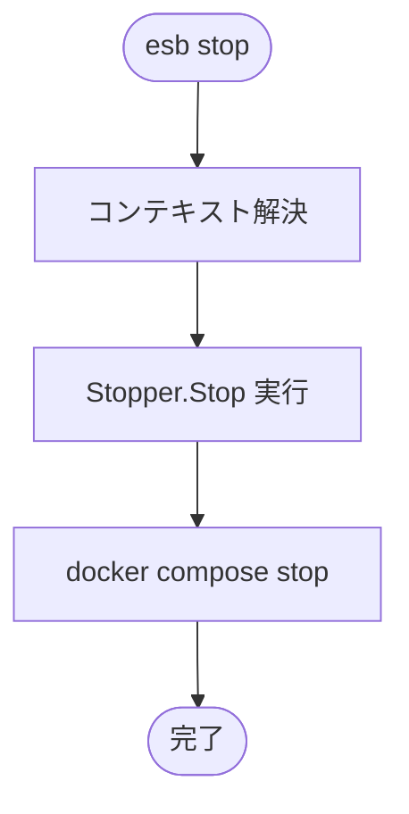

# `esb stop` コマンド

## 概要

`esb stop` コマンドは、現在の環境で稼働しているコンテナを削除せずに停止します。これにより、コンテナの状態が保持されるため、`esb down` と比較して後で素早く再起動できます。

## 使用方法

```bash
esb stop [flags]
```

### フラグ

| フラグ | 短縮形 | 説明 |
|--------|--------|------|
| `--env` | `-e` | ターゲット環境 (例: local)。デフォルトは最後に使用された環境です。 |
| `--force` | | 無効な `ESB_PROJECT`/`ESB_ENV` 環境変数を自動的に解除します。 |

## 実装詳細

CLIアダプタは `cli/internal/commands/stop.go`、オーケストレーションは `cli/internal/workflows/stop.go` が担当します。

### `down` との違い

- **`down`**: コンテナを停止し、**削除**します（ネットワークも含む）。
- **`stop`**: コンテナに SIGTERM/SIGKILL を送信するだけです。コンテナは `Exited` 状態で残ります。

### ロジックフロー

1. **コンテキスト解決**: Docker Composeのプロジェクト名を特定します。
2. **コマンド実行**: `StopWorkflow` が `Stopper.Stop` を呼び出します。
3. **Dockerアクション**: `docker compose stop` を実行します。

## フローチャート


