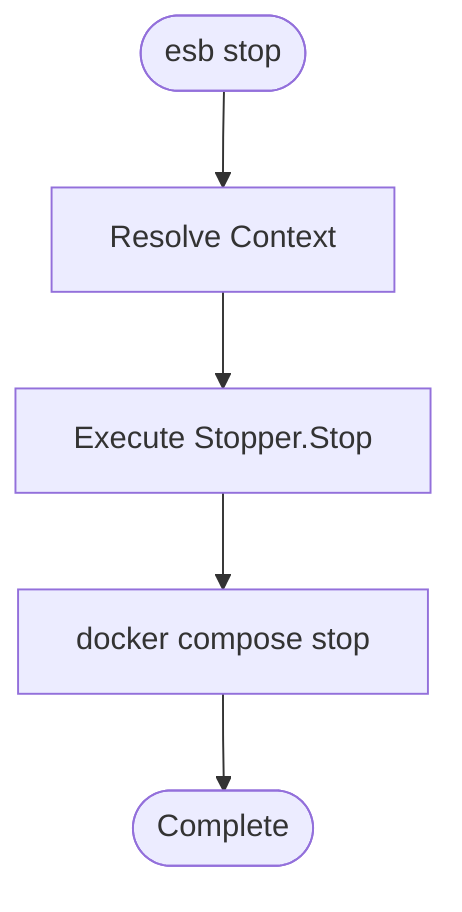

# `esb stop` Command

## Overview

The `esb stop` command halts the running containers for the current environment without removing them. This allows for a quicker restart later compared to `esb down`, as container state is preserved.

## Usage

```bash
esb stop [flags]
```

### Flags

| Flag | Short | Description |
|------|-------|-------------|
| `--env`, `-e` | | Target environment (e.g., local). Defaults to last used. |
| `--force` | | Auto-unset invalid `ESB_PROJECT`/`ESB_ENV` variables. |

## Implementation Details

The command logic is implemented in `cli/internal/app/stop.go`.

### Difference from `down`

- **`down`**: Stops containers and *removes* them (along with networks).
- **`stop`**: Only sends a SIGTERM/SIGKILL to the containers. They remain in the `Exited` state.

### Logic Flow

1. **Context Resolution**: Identifies the Docker Compose project name.
2. **Command Execution**: Invokes `Stopper.Stop`.
3. **Docker Action**: Executes `docker compose stop`.

## Mermaid Flowchart


