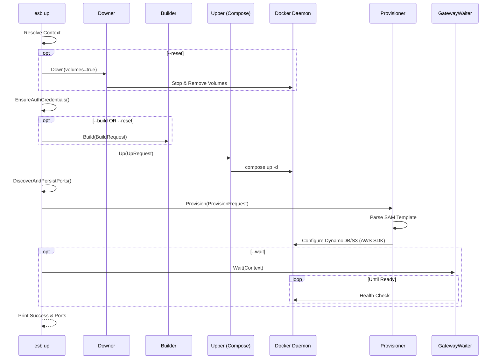

# `esb up` Command

## Overview

The `esb up` command starts the local serverless environment. It orchestrates the lifecycle by potentially building artifacts, starting containers via Docker Compose, and provisioning local AWS resources (DynamoDB, S3) defined in the SAM template.

## Usage

```bash
esb up [flags]
```

### Flags

| Flag | Short | Description |
|------|-------|-------------|
| `--env`, `-e` | | Target environment (e.g., local). Defaults to last used. |
| `--build` | | Rebuild images before starting. |
| `--reset` | | Reset environment (equivalent to `down --volumes` + `build` + `up`). |
| `--yes`, `-y` | | Skip confirmation prompt for `--reset`. |
| `--detach`, `-d` | | Run containers in background (default: true). |
| `--wait`, `-w` | | Wait for the gateway to be ready. |
| `--env-file` | | Path to custom `.env` file. |

## Implementation Details

The command logic is implemented in `cli/internal/app/up.go`. It acts as a high-level orchestrator relying on several interfaces: `Upper`, `Builder`, `Downer`, `Provisioner`, and `PortDiscoverer`.

### Workflow Steps

1. **Context Resolution**: Determines the active environment and project root.
2. **Reset (Optional)**: If `--reset` is set, calls `Downer.Down` with volume removal enabled.
3. **Authentication**: Ensures `auth.json` exists, generating default credentials if missing.
4. **Build (Optional)**: If `--build` or `--reset` is set, calls the `Builder` to regenerate images.
5. **Docker Compose Up**: Calls `Upper.Up` to start the containers (Gateway, Agent, etc.).
6. **Port Discovery**: Scans for dynamically assigned ports (if any) and persists them.
7. **Provisioning**: Parses `template.yaml` and configures local resources (tables, buckets) via the `Provisioner`.
8. **Wait (Optional)**: If `--wait` is set, polls the Gateway health endpoint until ready.

## Sequence Diagram


