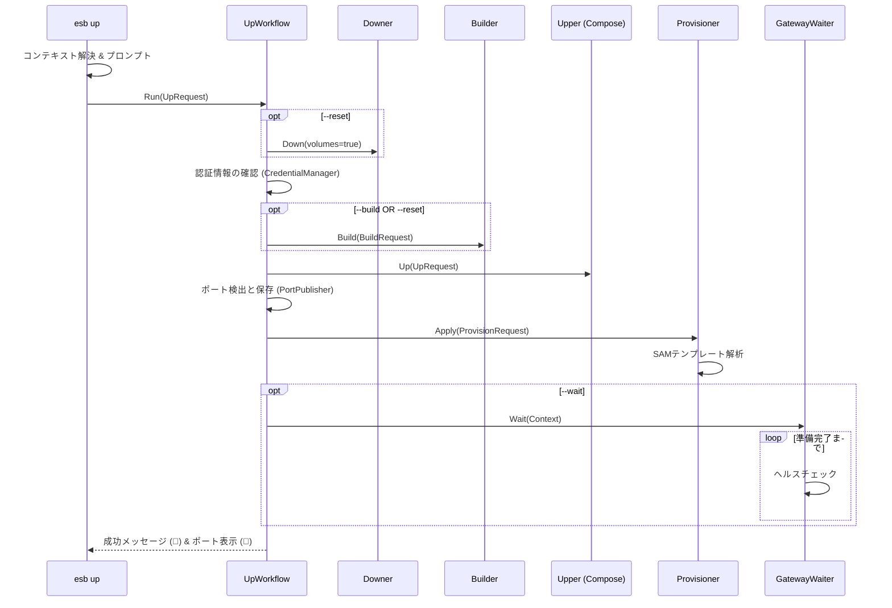

# `esb up` コマンド

## 概要

`esb up` コマンドは、ローカルサーバーレス環境を起動します。必要に応じて成果物のビルド、Docker Composeによるコンテナ起動、およびSAMテンプレートで定義されたローカルAWSリソース（DynamoDB, S3）のプロビジョニングを行い、ライフサイクルを管理します。

## 使用方法

```bash
esb up [flags]
```

### フラグ

| フラグ | 短縮形 | 説明 |
|--------|--------|------|
| `--env` | `-e` | ターゲット環境 (例: local)。デフォルトは最後に使用された環境です。 |
| `--build` | | 起動前にイメージを再ビルドします。 |
| `--reset` | | 環境をリセットします (`down --volumes` + `build` + `up` と同等)。 |
| `--yes` | `-y` | `--reset` 時の確認プロンプトをスキップします。 |
| `--detach` | `-d` | コンテナをバックグラウンドで実行します (デフォルト: true)。 |
| `--wait` | `-w` | ゲートウェイの準備完了を待機します。 |
| `--env-file` | | カスタム `.env` ファイルへのパスを指定します。 |
| `--force` | | 無効な `ESB_PROJECT`/`ESB_ENV` 環境変数を自動的に解除します。 |

## 実装詳細

CLIアダプタは `cli/internal/app/up.go`、オーケストレーションは `cli/internal/workflows/up.go` が担当します。ワークフローは `Upper`, `Builder`, `Downer`, `Provisioner`, `PortPublisher`, `CredentialManager`, `TemplateLoader/Parser`, `GatewayWaiter`, `RuntimeEnvApplier` などの `ports` を通じて実行されます。

### ワークフローステップ

1. **コンテキスト解決**: アクティブな環境とプロジェクトルートを決定します。
2. **ランタイム環境適用**: `RuntimeEnvApplier` が `ESB_*` 変数を適用します。
3. **リセット (オプション)**: `--reset` が指定された場合、ボリューム削除を有効にして `Downer.Down` を呼び出します。
4. **認証**: `CredentialManager` が不足している認証情報を生成します。
5. **ビルド (オプション)**: `--build` または `--reset` が指定された場合、`Builder` を呼び出してイメージを再生成します。
6. **Docker Compose Up**: `Upper.Up` を呼び出してコンテナ (Gateway, Agentなど) を起動します。
7. **ポート検出**: `PortPublisher` が動的ポートをスキャン・永続化します。
8. **プロビジョニング**: `TemplateLoader`/`TemplateParser` で `template.yaml` を解析し、`Provisioner` を介してローカルリソース (テーブル、バケット) を設定します。
9. **待機 (オプション)**: `--wait` が指定された場合、Gatewayのヘルスエンドポイントが準備完了になるまでポーリングします。
10. **完了表示**: 成功メッセージと発見されたポート（🔌）、認証情報（🔑）を表示します。

## シーケンス図


