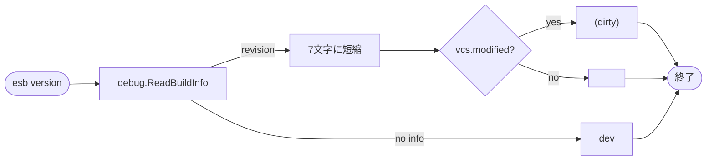

# `esb version` コマンド

## 概要
`esb version` は CLI のビルド情報からバージョンを表示します。

## 使用方法

```bash
esb version
```

## 実装詳細
- 実装: `cli/internal/version/version.go` / `cli/internal/command/app.go`
- `debug.ReadBuildInfo()` から `vcs.revision` / `vcs.modified` を取得
- リビジョンは **7文字**に短縮
- `vcs.modified=true` の場合は `(<dirty>)` を付与
- ビルド情報が無い場合は `dev` を表示

## フローチャート


